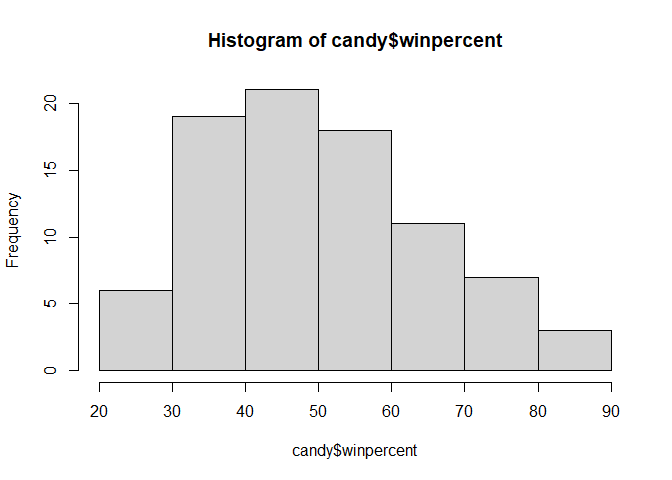
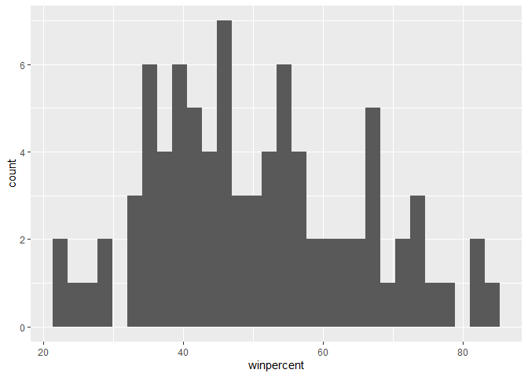
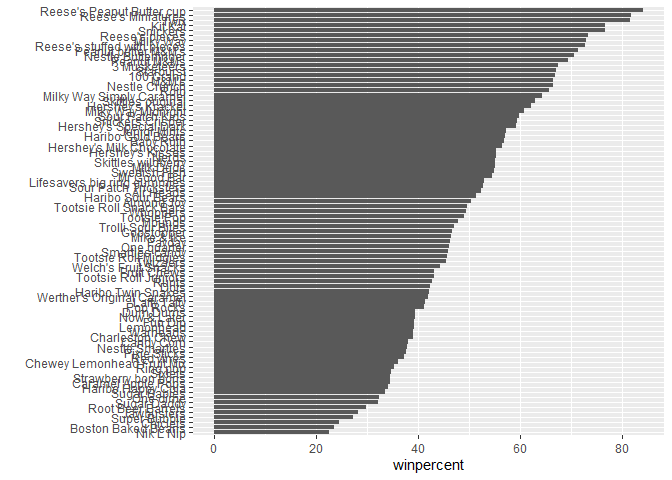
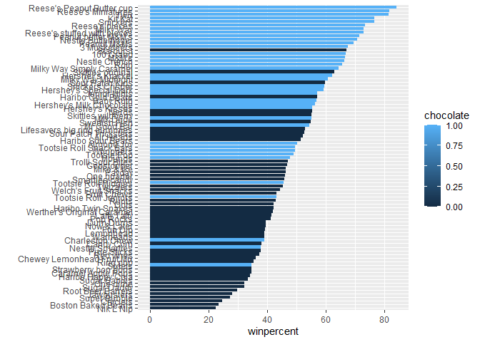
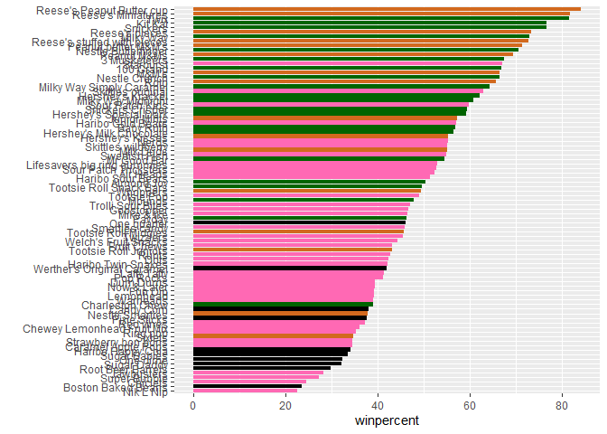
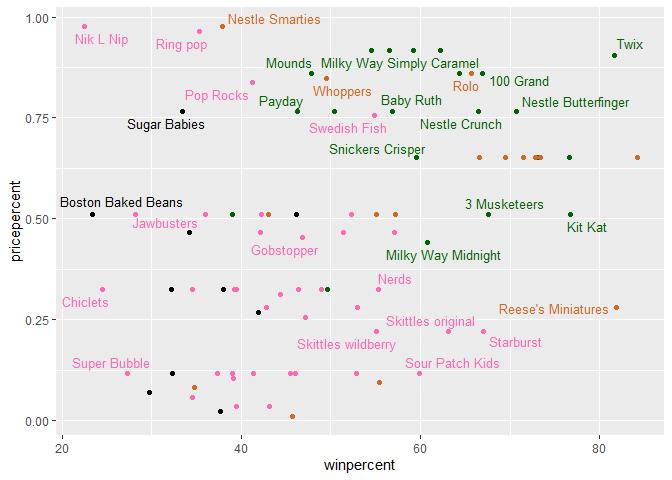
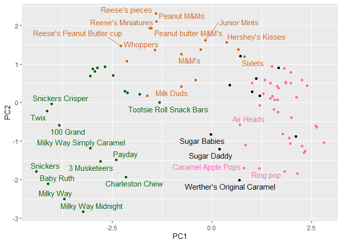
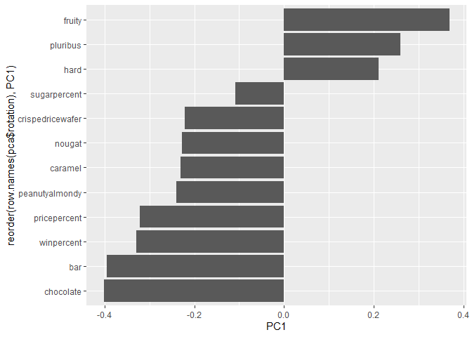

# Class 9: Candy Mini Project
Jolie Adair (PID A17337497)

## Background

In this mini-project, you will explore FiveThirtyEight’s Halloween Candy
Dataset.

We will use lots of **ggplot** some basic stats, correalation analysis
and PCA to make sense of the landscape of US candy - something hopefully
more relocatable than the prote transcriptomics work that we will use
these methods throughout the rest of the course.

## Data Import

peak with `head()`

``` r
candy <- read.csv("candy-data.csv", row.names = 1)
head(candy)
```

                 chocolate fruity caramel peanutyalmondy nougat crispedricewafer
    100 Grand            1      0       1              0      0                1
    3 Musketeers         1      0       0              0      1                0
    One dime             0      0       0              0      0                0
    One quarter          0      0       0              0      0                0
    Air Heads            0      1       0              0      0                0
    Almond Joy           1      0       0              1      0                0
                 hard bar pluribus sugarpercent pricepercent winpercent
    100 Grand       0   1        0        0.732        0.860   66.97173
    3 Musketeers    0   1        0        0.604        0.511   67.60294
    One dime        0   0        0        0.011        0.116   32.26109
    One quarter     0   0        0        0.011        0.511   46.11650
    Air Heads       0   0        0        0.906        0.511   52.34146
    Almond Joy      0   1        0        0.465        0.767   50.34755

> Q1. How many different candy types are in this dataset?

There are 85 different types of candy in this dataset.

``` r
nrow(candy)
```

    [1] 85

> Q2. How many fruity candy types are in the dataset?

``` r
candy$fruity
```

     [1] 0 0 0 0 1 0 0 0 0 1 0 1 1 1 1 1 1 1 1 0 1 1 0 0 0 0 1 0 0 1 1 1 0 0 1 0 0 0
    [39] 0 0 0 1 0 0 1 1 0 0 0 1 1 0 0 0 0 1 0 0 1 0 1 1 0 1 0 0 1 1 1 1 0 0 1 1 1 0
    [77] 0 0 1 0 1 1 1 0 0

``` r
sum(candy$fruity)
```

    [1] 38

> Q3. What is your favorite candy (other than Twix) in the dataset and
> what is it’s winpercent value?

``` r
library(dplyr)
```


    Attaching package: 'dplyr'

    The following objects are masked from 'package:stats':

        filter, lag

    The following objects are masked from 'package:base':

        intersect, setdiff, setequal, union

``` r
candy |> 
  filter(row.names(candy)=="Hershey's Milk Chocolate") |> 
  select(winpercent)
```

                             winpercent
    Hershey's Milk Chocolate    56.4905

> Q4. What is the winpercent value for “Kit Kat”?

``` r
candy["Kit Kat", "winpercent"]
```

    [1] 76.7686

> Q5. What is the winpercent value for “Tootsie Roll Snack Bars”?

``` r
candy["Tootsie Roll Snack Bars", "winpercent"]
```

    [1] 49.6535

> Q6. Is there any variable/column that looks to be on a different scale
> to the majority of the other columns in the dataset?

Yes, if we did PCA on the data, winpercent would dominate the scale.

``` r
library("skimr")
skim(candy)
```

|                                                  |       |
|:-------------------------------------------------|:------|
| Name                                             | candy |
| Number of rows                                   | 85    |
| Number of columns                                | 12    |
| \_\_\_\_\_\_\_\_\_\_\_\_\_\_\_\_\_\_\_\_\_\_\_   |       |
| Column type frequency:                           |       |
| numeric                                          | 12    |
| \_\_\_\_\_\_\_\_\_\_\_\_\_\_\_\_\_\_\_\_\_\_\_\_ |       |
| Group variables                                  | None  |

Data summary

**Variable type: numeric**

| skim_variable | n_missing | complete_rate | mean | sd | p0 | p25 | p50 | p75 | p100 | hist |
|:---|---:|---:|---:|---:|---:|---:|---:|---:|---:|:---|
| chocolate | 0 | 1 | 0.44 | 0.50 | 0.00 | 0.00 | 0.00 | 1.00 | 1.00 | ▇▁▁▁▆ |
| fruity | 0 | 1 | 0.45 | 0.50 | 0.00 | 0.00 | 0.00 | 1.00 | 1.00 | ▇▁▁▁▆ |
| caramel | 0 | 1 | 0.16 | 0.37 | 0.00 | 0.00 | 0.00 | 0.00 | 1.00 | ▇▁▁▁▂ |
| peanutyalmondy | 0 | 1 | 0.16 | 0.37 | 0.00 | 0.00 | 0.00 | 0.00 | 1.00 | ▇▁▁▁▂ |
| nougat | 0 | 1 | 0.08 | 0.28 | 0.00 | 0.00 | 0.00 | 0.00 | 1.00 | ▇▁▁▁▁ |
| crispedricewafer | 0 | 1 | 0.08 | 0.28 | 0.00 | 0.00 | 0.00 | 0.00 | 1.00 | ▇▁▁▁▁ |
| hard | 0 | 1 | 0.18 | 0.38 | 0.00 | 0.00 | 0.00 | 0.00 | 1.00 | ▇▁▁▁▂ |
| bar | 0 | 1 | 0.25 | 0.43 | 0.00 | 0.00 | 0.00 | 0.00 | 1.00 | ▇▁▁▁▂ |
| pluribus | 0 | 1 | 0.52 | 0.50 | 0.00 | 0.00 | 1.00 | 1.00 | 1.00 | ▇▁▁▁▇ |
| sugarpercent | 0 | 1 | 0.48 | 0.28 | 0.01 | 0.22 | 0.47 | 0.73 | 0.99 | ▇▇▇▇▆ |
| pricepercent | 0 | 1 | 0.47 | 0.29 | 0.01 | 0.26 | 0.47 | 0.65 | 0.98 | ▇▇▇▇▆ |
| winpercent | 0 | 1 | 50.32 | 14.71 | 22.45 | 39.14 | 47.83 | 59.86 | 84.18 | ▃▇▆▅▂ |

> Q7. What do you think a zero and one represent for the
> candy\$chocolate column?

``` r
library("skimr")
skim(candy$chocolate)
```

|                                                  |                  |
|:-------------------------------------------------|:-----------------|
| Name                                             | candy\$chocolate |
| Number of rows                                   | 85               |
| Number of columns                                | 1                |
| \_\_\_\_\_\_\_\_\_\_\_\_\_\_\_\_\_\_\_\_\_\_\_   |                  |
| Column type frequency:                           |                  |
| numeric                                          | 1                |
| \_\_\_\_\_\_\_\_\_\_\_\_\_\_\_\_\_\_\_\_\_\_\_\_ |                  |
| Group variables                                  | None             |

Data summary

**Variable type: numeric**

| skim_variable | n_missing | complete_rate | mean |  sd |  p0 | p25 | p50 | p75 | p100 | hist  |
|:--------------|----------:|--------------:|-----:|----:|----:|----:|----:|----:|-----:|:------|
| data          |         0 |             1 | 0.44 | 0.5 |   0 |   0 |   0 |   1 |    1 | ▇▁▁▁▆ |

## Exploratory Analysis

> Q8. Plot a histogram of winpercent values

``` r
hist(candy$winpercent)
```



``` r
library(ggplot2)

ggplot(candy) +
  aes(winpercent) +
  geom_histogram()
```

    `stat_bin()` using `bins = 30`. Pick better value `binwidth`.



> Q9. Is the distribution of winpercent values symmetrical?

No the distribution is not symmertical it is slightly skewed to left.

> Q10. Is the center of the distribution above or below 50%?

``` r
mean(candy$winpercent)
```

    [1] 50.31676

``` r
summary(candy$winpercent)
```

       Min. 1st Qu.  Median    Mean 3rd Qu.    Max. 
      22.45   39.14   47.83   50.32   59.86   84.18 

> Q11. On average is chocolate candy higher or lower ranked than fruit
> candy?

Chocolate candy is higher ranked than fruit candy.

``` r
choc.candy <-candy[candy$chocolate ==1, ]
choc.win <- choc.candy$winpercent
mean(choc.win)
```

    [1] 60.92153

``` r
fruity.win <- candy[candy$fruity == 1,]$winpercent
mean(fruity.win)
```

    [1] 44.11974

> Q12. Is this difference statistically significant?

Chocolate has a smaller p-value than Fruity candy

\]

``` r
chocolate_rank <- candy$winpercent[as.logical(candy$chocolate)]
candy_rank <- candy$winpercent[as.logical(candy$fruity)]

t.test(x = chocolate_rank, y = candy_rank)
```


        Welch Two Sample t-test

    data:  chocolate_rank and candy_rank
    t = 6.2582, df = 68.882, p-value = 2.871e-08
    alternative hypothesis: true difference in means is not equal to 0
    95 percent confidence interval:
     11.44563 22.15795
    sample estimates:
    mean of x mean of y 
     60.92153  44.11974 

## Overall Candy Rankings

> Q13. What are the five least liked candy types in this set?

``` r
y = c("y", "a", "z")
sort(y)
```

    [1] "a" "y" "z"

``` r
y
```

    [1] "y" "a" "z"

``` r
order(y)
```

    [1] 2 1 3

``` r
ord.ind <- order(candy$winpercent)
head(candy[ord.ind, ])
```

                       chocolate fruity caramel peanutyalmondy nougat
    Nik L Nip                  0      1       0              0      0
    Boston Baked Beans         0      0       0              1      0
    Chiclets                   0      1       0              0      0
    Super Bubble               0      1       0              0      0
    Jawbusters                 0      1       0              0      0
    Root Beer Barrels          0      0       0              0      0
                       crispedricewafer hard bar pluribus sugarpercent pricepercent
    Nik L Nip                         0    0   0        1        0.197        0.976
    Boston Baked Beans                0    0   0        1        0.313        0.511
    Chiclets                          0    0   0        1        0.046        0.325
    Super Bubble                      0    0   0        0        0.162        0.116
    Jawbusters                        0    1   0        1        0.093        0.511
    Root Beer Barrels                 0    1   0        1        0.732        0.069
                       winpercent
    Nik L Nip            22.44534
    Boston Baked Beans   23.41782
    Chiclets             24.52499
    Super Bubble         27.30386
    Jawbusters           28.12744
    Root Beer Barrels    29.70369

> Q14. What are the top 5 all time favorite candy types out of this set?

``` r
head(candy[ord.ind, ], 5)
```

                       chocolate fruity caramel peanutyalmondy nougat
    Nik L Nip                  0      1       0              0      0
    Boston Baked Beans         0      0       0              1      0
    Chiclets                   0      1       0              0      0
    Super Bubble               0      1       0              0      0
    Jawbusters                 0      1       0              0      0
                       crispedricewafer hard bar pluribus sugarpercent pricepercent
    Nik L Nip                         0    0   0        1        0.197        0.976
    Boston Baked Beans                0    0   0        1        0.313        0.511
    Chiclets                          0    0   0        1        0.046        0.325
    Super Bubble                      0    0   0        0        0.162        0.116
    Jawbusters                        0    1   0        1        0.093        0.511
                       winpercent
    Nik L Nip            22.44534
    Boston Baked Beans   23.41782
    Chiclets             24.52499
    Super Bubble         27.30386
    Jawbusters           28.12744

> Q15. Make a first barplot of candy ranking based on winpercent values.

``` r
ggplot(candy) + 
  aes(winpercent,
      reorder(row.names(candy),winpercent)) +
  geom_col() +
  ylab("")
```



``` r
ggplot(candy) + 
  aes(winpercent,
      reorder(row.names(candy),winpercent), 
      fill=chocolate) +
  geom_col() +
  ylab("")
```



We need a custom color vector

> Q16. This is quite ugly, use the reorder() function to get the bars
> sorted by winpercent?

``` r
my_cols <- rep("black", nrow(candy))
#my_cols[1] <- "red"  first element is red
my_cols[candy$chocolate==1] <- "chocolate"
my_cols[candy$bar==1] <- "darkgreen"
my_cols[candy$fruity==1] <- "hotpink"
my_cols
```

     [1] "darkgreen" "darkgreen" "black"     "black"     "hotpink"   "darkgreen"
     [7] "darkgreen" "black"     "black"     "hotpink"   "darkgreen" "hotpink"  
    [13] "hotpink"   "hotpink"   "hotpink"   "hotpink"   "hotpink"   "hotpink"  
    [19] "hotpink"   "black"     "hotpink"   "hotpink"   "chocolate" "darkgreen"
    [25] "darkgreen" "darkgreen" "hotpink"   "chocolate" "darkgreen" "hotpink"  
    [31] "hotpink"   "hotpink"   "chocolate" "chocolate" "hotpink"   "chocolate"
    [37] "darkgreen" "darkgreen" "darkgreen" "darkgreen" "darkgreen" "hotpink"  
    [43] "darkgreen" "darkgreen" "hotpink"   "hotpink"   "darkgreen" "chocolate"
    [49] "black"     "hotpink"   "hotpink"   "chocolate" "chocolate" "chocolate"
    [55] "chocolate" "hotpink"   "chocolate" "black"     "hotpink"   "chocolate"
    [61] "hotpink"   "hotpink"   "chocolate" "hotpink"   "darkgreen" "darkgreen"
    [67] "hotpink"   "hotpink"   "hotpink"   "hotpink"   "black"     "black"    
    [73] "hotpink"   "hotpink"   "hotpink"   "chocolate" "chocolate" "darkgreen"
    [79] "hotpink"   "darkgreen" "hotpink"   "hotpink"   "hotpink"   "black"    
    [85] "chocolate"

``` r
ggplot(candy) + 
  aes(winpercent,
      reorder(row.names(candy),winpercent)) +
  geom_col(fill=my_cols) +
  ylab("")
```



> Q17. What is the worst ranked chocolate candy?

Sixlets

> Q18. What is the best ranked fruity candy?

Starburst

## Taking a look at pricepercent

``` r
library(ggrepel)

# How about a plot of win vs price
ggplot(candy) +
  aes(winpercent, pricepercent, label=rownames(candy)) +
  geom_point(col=my_cols) + 
  geom_text_repel(col=my_cols, size=3.3, max.overlaps = 5)
```

    Warning: ggrepel: 54 unlabeled data points (too many overlaps). Consider
    increasing max.overlaps



> Q19. Which candy type is the highest ranked in terms of `winpercent`
> for the least money - i.e. offers the most bang for your buck?

Nik L Nip

> Q20. What are the top 5 most expensive candy types in the dataset and
> of these which is the least popular?

Twix Kit Kat Reese’s Peanut Butter Cup starburst Reese’s Minaiatures

## Exploring the correlation structure

``` r
cij <- cor(candy)
```

``` r
library(corrplot)
```

    corrplot 0.95 loaded

``` r
corrplot(cij)
```


> Q22. Examining this plot what two variables are anti-correlated
> (i.e. have minus values)?

Chocolate and fruit are anti-correlated.

> Q23. Similarly, what two variables are most positively correlated?

Chocolate and bar are the most positively correlated.

## Principal Component Analysis

``` r
pca <- prcomp(candy, scale=TRUE)
summary(pca)
```

    Importance of components:
                              PC1    PC2    PC3     PC4    PC5     PC6     PC7
    Standard deviation     2.0788 1.1378 1.1092 1.07533 0.9518 0.81923 0.81530
    Proportion of Variance 0.3601 0.1079 0.1025 0.09636 0.0755 0.05593 0.05539
    Cumulative Proportion  0.3601 0.4680 0.5705 0.66688 0.7424 0.79830 0.85369
                               PC8     PC9    PC10    PC11    PC12
    Standard deviation     0.74530 0.67824 0.62349 0.43974 0.39760
    Proportion of Variance 0.04629 0.03833 0.03239 0.01611 0.01317
    Cumulative Proportion  0.89998 0.93832 0.97071 0.98683 1.00000

Score Plot…

``` r
ggplot(pca$x) +
  aes(PC1, PC2, label=row.names(pca$x)) +
  geom_point(col=my_cols)+
  geom_text_repel(max.overlaps = 5, col=my_cols)
```

    Warning: ggrepel: 56 unlabeled data points (too many overlaps). Consider
    increasing max.overlaps



``` r
ggplot(pca$rotation) + 
  aes(PC1, 
      reorder(row.names(pca$rotation), PC1)) +
  geom_col()
```



``` r
#library(plotly)
#ggplotly(p)
```

> Q24. Complete the code to generate the loadings plot above. What
> original variables are picked up strongly by PC1 in the positive
> direction? Do these make sense to you? Where did you see this
> relationship highlighted previously?

PC1 is driven positively due to fruity and hard candies while chocolate
and bar candies make it negative.

> Q25. Based on your exploratory analysis, correlation findings, and PCA
> results, what combination of characteristics appears to make a
> “winning” candy? How do these different analyses (visualization,
> correlation, PCA) support or complement each other in reaching this
> conclusion?

The combined characteristics that make a winning candy is having the
characteristics of chocolate and a bar, they have higher winpercent
values and positive correlation as seen on the plots.
