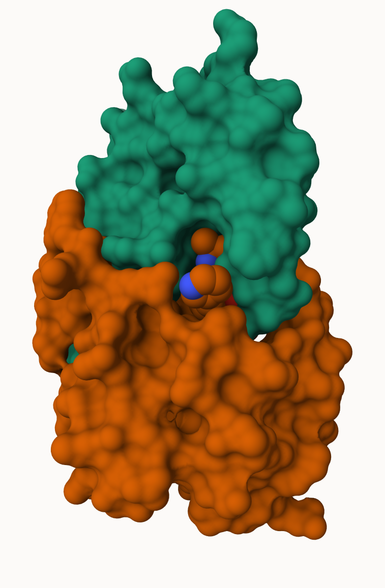
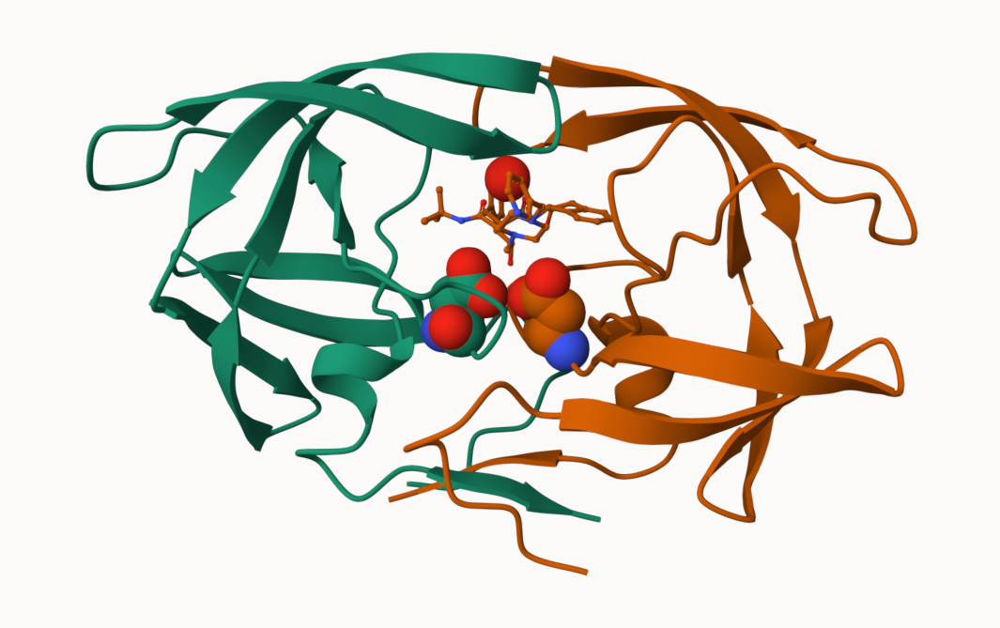
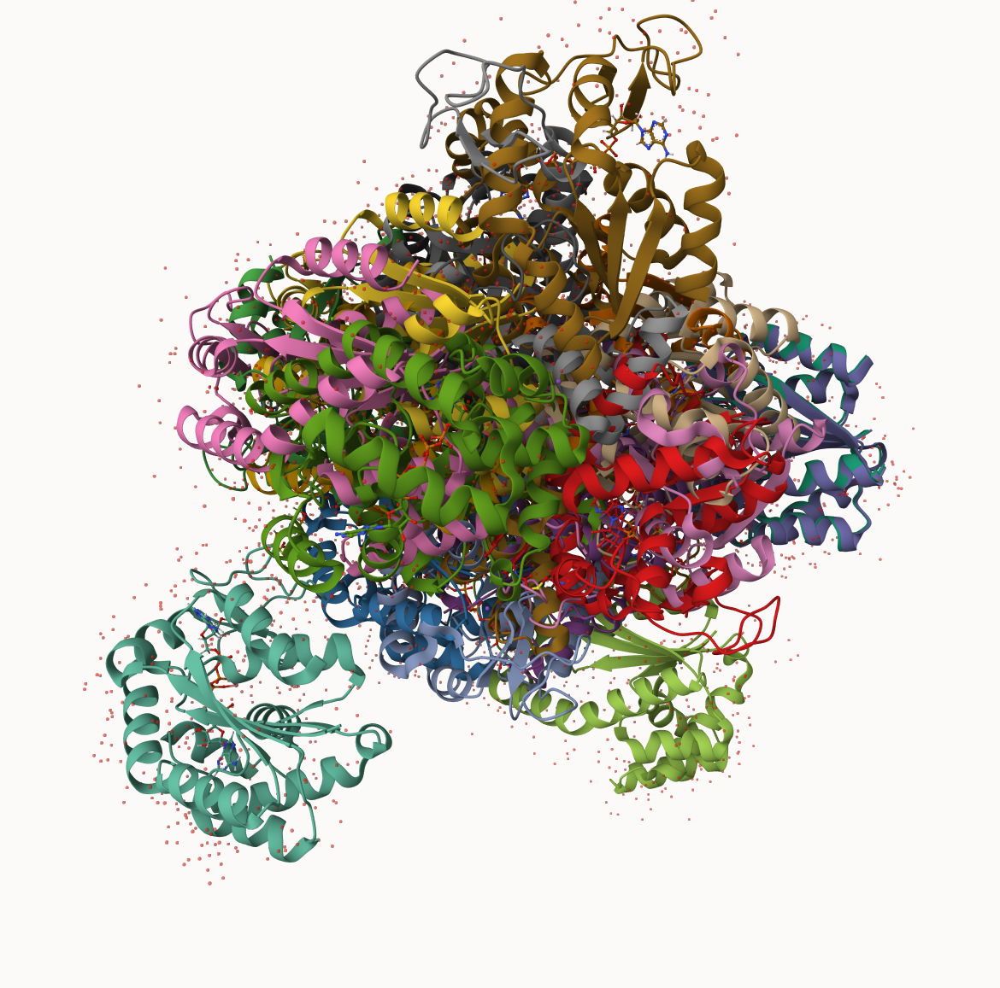

## PBD Statistics

The Protein Data Bank (PBD) is the main repository of biomolecular structures. Let's see what it contains:

Q1

```{r}
stats <- read.csv("Data Export Summary.csv")
stats
```


```{r}
stats$X.ray
```

```{r}
sum(stats$Neutron)
```
The comma in these numbers leads to the numbers here being read as character.

```{r}
c(100, 10, "jolie")
```

```{r}
library(readr)
stats <- read_csv("Data Export Summary.csv")
stats
```
```{r}
n.xray <- sum(stats$`X-ray`)
#n.em <- 
n.total <- sum(stats$Total)

n.xray/n.total
```


> Q1: What percentage of structures in the PDB are solved by X-Ray and Electron Microscopy.

X-ray = 81%

EM = 13%

```{r}
n.xray/n.total
```
```{r}
n.em <- sum(stats$EM)
n.em/n.total
```


> Q2: What proportion of structures in the PDB are protein?

```{r}
rowsum <- sum(stats[2, c(2:9)])
rowsum/sum(stats$Total)
```
11.2% is the proportion of structures in the PBD are protein.

> Q3: SKIP


## Visualizing the HIV-1 protease structure

We can use the Molstar viewer online: https://molstar.org/viewer/




A new clean image showing the catalytic ASP25 amino acids in both chains of the HIV-PR dimer along with the inhibitor and all important active site water.



## Bio3D packages for structual bioinformatics

```{r}
library(bio3d)
pdb <-read.pdb("1hsg")
pdb
```

```{r}
head(pdb$atom)
```

```{r}
library(bio3dview)
view.pdb(pdb)
```


```{r}
# Select the important ASP 25 residue
sele <- atom.select(pdb, resno=25)

# and highlight them in spacefill representation
view.pdb(pdb, cols=c("navy","orange"), 
        highlight = sele,
        highlight.style = "spacefill")
```


## Predicting functional motions of a single structure

Read an ADK structure from the PBD database:

```{r}
 adk <- read.pdb("6s36")
 adk
```

```{r}
m <- nma(adk)
plot(m)
```

write out our results as a wee trajectory/movie of a predicted 

```{r}
mktrj(m, file="adk_m7.pdb")
```

## Comparative Data Analysis

First step find an ADK sequence:

```{r}
library(bio3d)
id <-  "1ake_A" ## Change this to run a different analysis
aa <- get.seq(id) 
```

```{r}
aa
```

Next step, is search the PDB database for all related entries:

```{r}
blast <-blast.pdb(aa)
hits <- plot(blast)
```

All blast results are here for us to see:
```{r}
blast$hit.tbl
```


The "top hits" are in the `hit` object. Now we can download these to our computer. Put these in a wee sub folder (directory) called "pdbs" and use grip to speed up.

```{r}
# Download releated PDB files
files <- get.pdb(hits$pdb.id, path="pdbs", split=TRUE, gzip=TRUE)
```


These look like a hot mess



Next we will use the `pdbaln()`function to align and also optionally fit (superpose) the identified PBD structures.

This require a BioConductor package called "msa" that we need to install. First we install BiocManager. Then we use `BiocManager::install.packages("msa")`

```{r}
# Align releated PDBs
pdbs <- pdbaln(files, fit = TRUE, exefile="msa")
```

```{r}
library(BiocManager)
BiocManager::install("msa")
```
```{r}
pdbs <- pdbaln(files, fit=T, exefile="msa")
```

We could view these R with **bio3dview** `view.pdbs()` function.
```{r}
library(bio3dview)
view.pdbs(pdbs, colorScheme = "residue")
```

## PCA

We can run PCA on our `pdbs` objects using the `pca()` function from **bio3d**:

```{r}
pc.xray <- pca(pdbs)
plot(pc.xray)
```

```{r}
plot(pc.xray, 1:2)
```

We can make a visualization of the major conformational difference (i.e. large scale structure change) captured by our PCA analysis with the `mktrj()` function.

```{r}
pca1 <- mktrj(pc.xray, file="pca.pdb")
```


What is the total numbers of entries in the PDB 
```{r}

```


