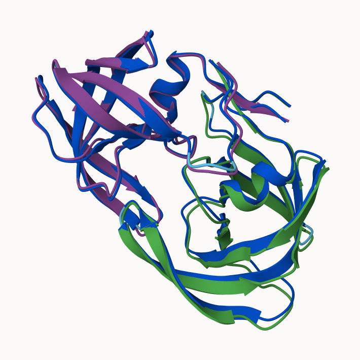
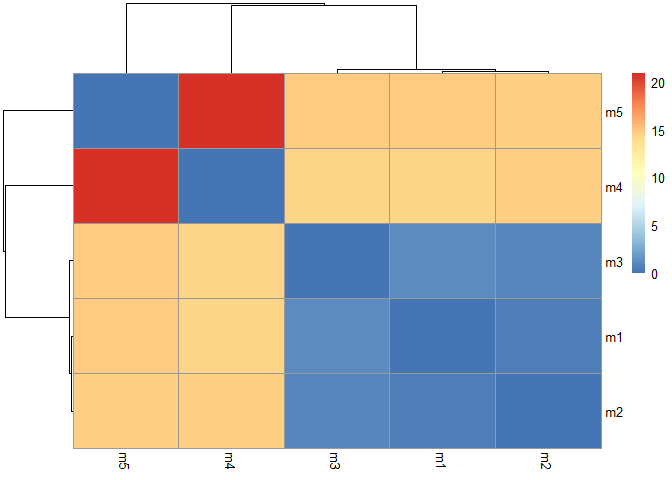

# Class 11 AlphaFold
Jolie Adair (PID A17337497)

## Background

We saw the last day that the main repository for biomolecular structure
(the PDB database) only has ~250,00 entries.

UniProtKB (the main protein sequence database) has over 200 million
entries

## AlphaFold

In this hands-on session we will utilize AlphaFold to predict protein
structure from sequence (Jumper et al. 2021).

Without the aid of such approaches, it can take years of expensive
Laboratory work to determine the structure of just one protein. With
Alphafold we can now accurately compute a typical protein structure in
as Little as ten minutes.

## The EBI AlphaFold database

The EBI Alphafold database contains lots of computed structure models.
It is increasingly likely that the structure you are intrested in is
already in this dababase. \< http://alphafold.ebi.ac.uk \> There are 3
nmajor outputs from AlphaFold

1.  A model of sturturce in **PBD** format.
2.  A **plDDT score**: that tells us how confident the models is for a
    given residue in your protein (High values are good, above 70)
3.  a **PAE score** that tells us about protein packing qualitiy.

If you can’t find the a matching entry for the sequence you ar
interested in AFDB you can run AlphaFold yourself…

## Running AlphFold

We will use CloabFOld to run AlphaFold on our sequence \<
https://github.com/sokrypton/ColabFold \>

https://colab.research.google.com/github/sokrypton/ColabFold/blob/main/AlphaFold2.ipynb

Figure from AlphaFold here



## Interpreting Results

Custom Analysis of resulting models

We can read all the AlphaFold results into R and do more quanitiative
analysis than just viewing the structures in Mol-star:

Read all the PDB models:

``` r
library(bio3d)
pdbfiles<- list.files("HIVpr_23119/", pattern= ".pdb", full.names = T)
hivpbs <- pdbaln(pdbfiles, fit=T, exefile="msa")
```

    Reading PDB files:
    HIVpr_23119/HIVpr_23119_unrelaxed_rank_001_alphafold2_multimer_v3_model_4_seed_000.pdb
    HIVpr_23119/HIVpr_23119_unrelaxed_rank_002_alphafold2_multimer_v3_model_1_seed_000.pdb
    HIVpr_23119/HIVpr_23119_unrelaxed_rank_003_alphafold2_multimer_v3_model_5_seed_000.pdb
    HIVpr_23119/HIVpr_23119_unrelaxed_rank_004_alphafold2_multimer_v3_model_2_seed_000.pdb
    HIVpr_23119/HIVpr_23119_unrelaxed_rank_005_alphafold2_multimer_v3_model_3_seed_000.pdb
    .....

    Extracting sequences

    pdb/seq: 1   name: HIVpr_23119/HIVpr_23119_unrelaxed_rank_001_alphafold2_multimer_v3_model_4_seed_000.pdb 
    pdb/seq: 2   name: HIVpr_23119/HIVpr_23119_unrelaxed_rank_002_alphafold2_multimer_v3_model_1_seed_000.pdb 
    pdb/seq: 3   name: HIVpr_23119/HIVpr_23119_unrelaxed_rank_003_alphafold2_multimer_v3_model_5_seed_000.pdb 
    pdb/seq: 4   name: HIVpr_23119/HIVpr_23119_unrelaxed_rank_004_alphafold2_multimer_v3_model_2_seed_000.pdb 
    pdb/seq: 5   name: HIVpr_23119/HIVpr_23119_unrelaxed_rank_005_alphafold2_multimer_v3_model_3_seed_000.pdb 

``` r
#library(bio3dview)
#view.pdbs(hivpbs)
```

``` r
rd <- rmsd(hivpbs)
```

    Warning in rmsd(hivpbs): No indices provided, using the 198 non NA positions

``` r
library(pheatmap)
colnames(rd) <- paste0("m", 1:5)
rownames(rd) <- paste0("m", 1:5)
pheatmap(rd)
```


