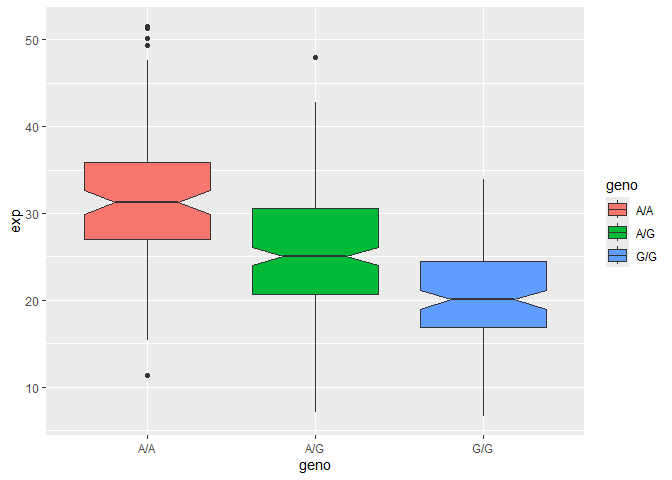

# Class 12: Genome informatics
Jolie Adair (PID 17337497)

## Section 4: Population Scale Analysis \[HOMEWORK\]

One sample is obviously not enough to know what is happening in a
population. You are interested in assessing genetic differences on a
population scale. So, you processed about ~230 samples and did the
normalization on a genome level. Now, you want to find whether there is
any association of the 4 asthma-associated SNPs (rs8067378…) on ORMDL3
expression.

This is the final file you got (
https://bioboot.github.io/bggn213_W19/class-material/rs8067378_ENSG00000172057.6.txt
). The first column is sample name, the second column is genotype and
the third column are the expression values.

> Q13: Read this file into R and determine the sample size for each
> genotype and their corresponding median expression levels for each of
> these genotypes. Hint: The read.table(), summary() and boxplot()
> functions will likely be useful here. There is an example R script
> online to be used ONLY if you are struggling in vein. Note that you
> can find the medium value from saving the output of the boxplot()
> function to an R object and examining this object. There is also the
> medium() and summary() function that you can use to check your
> understanding.

The dataset included 462 total samples, with genotype counts of 108 A/A,
233 A/G, and 121 G/G. The median expression levels were 31.25 for A/A,
25.06 for A/G, and 20.07 for G/G. These results indicate that ORMDL3
expression is highest in individuals with the A/A genotype and lowest in
those with the G/G genotype.

``` r
bob <- read.table("BunchOfGenes")
head(bob)
```

       sample geno      exp
    1 HG00367  A/G 28.96038
    2 NA20768  A/G 20.24449
    3 HG00361  A/A 31.32628
    4 HG00135  A/A 34.11169
    5 NA18870  G/G 18.25141
    6 NA11993  A/A 32.89721

``` r
nrow(bob)
```

    [1] 462

``` r
table(bob$geno)
```


    A/A A/G G/G 
    108 233 121 

``` r
tapply(bob$exp, bob$geno, median)
```

         A/A      A/G      G/G 
    31.24847 25.06486 20.07363 

``` r
summary(bob)
```

        sample              geno                exp        
     Length:462         Length:462         Min.   : 6.675  
     Class :character   Class :character   1st Qu.:20.004  
     Mode  :character   Mode  :character   Median :25.116  
                                           Mean   :25.640  
                                           3rd Qu.:30.779  
                                           Max.   :51.518  

> Q14: Generate a boxplot with a box per genotype, what could you infer
> from the relative expression value between A/A and G/G displayed in
> this plot? Does the SNP effect the expression of ORMDL3? Hint: An
> example boxplot is provided overleaf – yours does not need to be as
> polished as this one.

The boxplot demonstrates that individuals with the A/A genotype exhibit
the highest levels of ORMDL3 expression, whereas those with the G/G
genotype show the lowest levels. This pattern suggests that the
rs8067378 SNP is linked to variation in ORMDL3 expression, indicating
that this SNP likely influences gene expression.

``` r
library(ggplot2)


ggplot(bob) +
aes(geno, exp, fill = geno) +
geom_boxplot(notch = TRUE)
```


