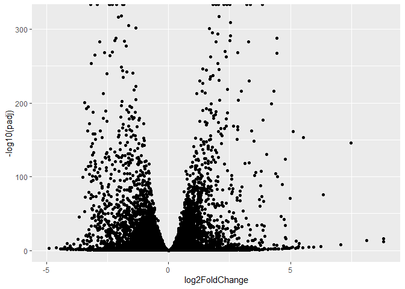
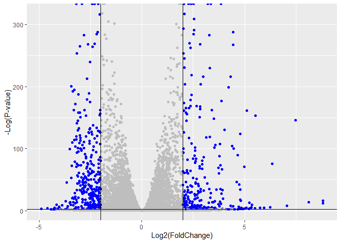

# Class 14: RNA-Seq analysis mini-project
Jolie Adair (PID A17337497)

- [Background](#background)
- [Data Import](#data-import)
- [Check and Tidy](#check-and-tidy)
- [Remove zero counts genes](#remove-zero-counts-genes)
- [Run DESeq](#run-deseq)
- [Results](#results)
- [Get Results](#get-results)
- [Volcano plot](#volcano-plot)
- [Add Annotation](#add-annotation)
- [MapIds](#mapids)
- [Pathway Analysis](#pathway-analysis)
- [Go Analysis](#go-analysis)
- [OPTIONAL Identify top significant
  genes](#optional-identify-top-significant-genes)

## Background

## Data Import

We have 2 ket input files: counts and metadata

``` r
countData <- read.csv("GSE37704_featurecounts.csv", row.names=1)
head(countData)
```

                    length SRR493366 SRR493367 SRR493368 SRR493369 SRR493370
    ENSG00000186092    918         0         0         0         0         0
    ENSG00000279928    718         0         0         0         0         0
    ENSG00000279457   1982        23        28        29        29        28
    ENSG00000278566    939         0         0         0         0         0
    ENSG00000273547    939         0         0         0         0         0
    ENSG00000187634   3214       124       123       205       207       212
                    SRR493371
    ENSG00000186092         0
    ENSG00000279928         0
    ENSG00000279457        46
    ENSG00000278566         0
    ENSG00000273547         0
    ENSG00000187634       258

``` r
colData <- read.csv("GSE37704_metadata.csv", row.names=1)
head(colData)
```

                  condition
    SRR493366 control_sirna
    SRR493367 control_sirna
    SRR493368 control_sirna
    SRR493369      hoxa1_kd
    SRR493370      hoxa1_kd
    SRR493371      hoxa1_kd

We need to remove the first length” column from `countData` to have a
1:! corespondance with `colData` rows.

``` r
rownames(colData) == colnames(countData)
```

    Warning in rownames(colData) == colnames(countData): longer object length is
    not a multiple of shorter object length

    [1] FALSE FALSE FALSE FALSE FALSE FALSE FALSE

## Check and Tidy

> Q. Complete the code below to remove the troublesome first column from
> countData

``` r
countData <- as.matrix(countData[, -1])
head(countData)
```

                    SRR493366 SRR493367 SRR493368 SRR493369 SRR493370 SRR493371
    ENSG00000186092         0         0         0         0         0         0
    ENSG00000279928         0         0         0         0         0         0
    ENSG00000279457        23        28        29        29        28        46
    ENSG00000278566         0         0         0         0         0         0
    ENSG00000273547         0         0         0         0         0         0
    ENSG00000187634       124       123       205       207       212       258

> Q2. Complete the code below to filter countData to exclude genes
> (i.e. rows) where we have 0 read count across all samples
> (i.e. columns).

``` r
countData = countData[rowSums(countData) > 0,]
head(countData)
```

                    SRR493366 SRR493367 SRR493368 SRR493369 SRR493370 SRR493371
    ENSG00000279457        23        28        29        29        28        46
    ENSG00000187634       124       123       205       207       212       258
    ENSG00000188976      1637      1831      2383      1226      1326      1504
    ENSG00000187961       120       153       180       236       255       357
    ENSG00000187583        24        48        65        44        48        64
    ENSG00000187642         4         9        16        14        16        16

## Remove zero counts genes

Some genes (rows) have no count data (i.e. zero values). We should
remove these before any further analysis.

``` r
to.keep <- rowSums(countData) > 0
countData <- countData[to.keep, ]
```

## Run DESeq

``` r
library(DESeq2)
```

    Loading required package: S4Vectors

    Loading required package: stats4

    Loading required package: BiocGenerics

    Loading required package: generics


    Attaching package: 'generics'

    The following objects are masked from 'package:base':

        as.difftime, as.factor, as.ordered, intersect, is.element, setdiff,
        setequal, union


    Attaching package: 'BiocGenerics'

    The following objects are masked from 'package:stats':

        IQR, mad, sd, var, xtabs

    The following objects are masked from 'package:base':

        anyDuplicated, aperm, append, as.data.frame, basename, cbind,
        colnames, dirname, do.call, duplicated, eval, evalq, Filter, Find,
        get, grep, grepl, is.unsorted, lapply, Map, mapply, match, mget,
        order, paste, pmax, pmax.int, pmin, pmin.int, Position, rank,
        rbind, Reduce, rownames, sapply, saveRDS, table, tapply, unique,
        unsplit, which.max, which.min


    Attaching package: 'S4Vectors'

    The following object is masked from 'package:utils':

        findMatches

    The following objects are masked from 'package:base':

        expand.grid, I, unname

    Loading required package: IRanges


    Attaching package: 'IRanges'

    The following object is masked from 'package:grDevices':

        windows

    Loading required package: GenomicRanges

    Loading required package: Seqinfo

    Loading required package: SummarizedExperiment

    Loading required package: MatrixGenerics

    Loading required package: matrixStats


    Attaching package: 'MatrixGenerics'

    The following objects are masked from 'package:matrixStats':

        colAlls, colAnyNAs, colAnys, colAvgsPerRowSet, colCollapse,
        colCounts, colCummaxs, colCummins, colCumprods, colCumsums,
        colDiffs, colIQRDiffs, colIQRs, colLogSumExps, colMadDiffs,
        colMads, colMaxs, colMeans2, colMedians, colMins, colOrderStats,
        colProds, colQuantiles, colRanges, colRanks, colSdDiffs, colSds,
        colSums2, colTabulates, colVarDiffs, colVars, colWeightedMads,
        colWeightedMeans, colWeightedMedians, colWeightedSds,
        colWeightedVars, rowAlls, rowAnyNAs, rowAnys, rowAvgsPerColSet,
        rowCollapse, rowCounts, rowCummaxs, rowCummins, rowCumprods,
        rowCumsums, rowDiffs, rowIQRDiffs, rowIQRs, rowLogSumExps,
        rowMadDiffs, rowMads, rowMaxs, rowMeans2, rowMedians, rowMins,
        rowOrderStats, rowProds, rowQuantiles, rowRanges, rowRanks,
        rowSdDiffs, rowSds, rowSums2, rowTabulates, rowVarDiffs, rowVars,
        rowWeightedMads, rowWeightedMeans, rowWeightedMedians,
        rowWeightedSds, rowWeightedVars

    Loading required package: Biobase

    Welcome to Bioconductor

        Vignettes contain introductory material; view with
        'browseVignettes()'. To cite Bioconductor, see
        'citation("Biobase")', and for packages 'citation("pkgname")'.


    Attaching package: 'Biobase'

    The following object is masked from 'package:MatrixGenerics':

        rowMedians

    The following objects are masked from 'package:matrixStats':

        anyMissing, rowMedians

``` r
dds <- DESeqDataSetFromMatrix(countData = countData, 
                       colData = colData, 
                       design = ~condition)
```

    Warning in DESeqDataSet(se, design = design, ignoreRank): some variables in
    design formula are characters, converting to factors

``` r
dds= DESeq(dds)
```

    estimating size factors

    estimating dispersions

    gene-wise dispersion estimates

    mean-dispersion relationship

    final dispersion estimates

    fitting model and testing

## Results

``` r
res <- results(dds)
res
```

    log2 fold change (MLE): condition hoxa1 kd vs control sirna 
    Wald test p-value: condition hoxa1 kd vs control sirna 
    DataFrame with 15975 rows and 6 columns
                     baseMean log2FoldChange     lfcSE       stat      pvalue
                    <numeric>      <numeric> <numeric>  <numeric>   <numeric>
    ENSG00000279457   29.9136      0.1792571 0.3248216   0.551863 5.81042e-01
    ENSG00000187634  183.2296      0.4264571 0.1402658   3.040350 2.36304e-03
    ENSG00000188976 1651.1881     -0.6927205 0.0548465 -12.630158 1.43990e-36
    ENSG00000187961  209.6379      0.7297556 0.1318599   5.534326 3.12428e-08
    ENSG00000187583   47.2551      0.0405765 0.2718928   0.149237 8.81366e-01
    ...                   ...            ...       ...        ...         ...
    ENSG00000273748  35.30265       0.674387  0.303666   2.220817 2.63633e-02
    ENSG00000278817   2.42302      -0.388988  1.130394  -0.344117 7.30758e-01
    ENSG00000278384   1.10180       0.332991  1.660261   0.200565 8.41039e-01
    ENSG00000276345  73.64496      -0.356181  0.207716  -1.714752 8.63908e-02
    ENSG00000271254 181.59590      -0.609667  0.141320  -4.314071 1.60276e-05
                           padj
                      <numeric>
    ENSG00000279457 6.86555e-01
    ENSG00000187634 5.15718e-03
    ENSG00000188976 1.76549e-35
    ENSG00000187961 1.13413e-07
    ENSG00000187583 9.19031e-01
    ...                     ...
    ENSG00000273748 4.79091e-02
    ENSG00000278817 8.09772e-01
    ENSG00000278384 8.92654e-01
    ENSG00000276345 1.39762e-01
    ENSG00000271254 4.53648e-05

## Get Results

> Q. Call the summary() function on your results to get a sense of how
> many genes are up or down-regulated at the default 0.1 p-value cutoff.

``` r
summary(res)
```


    out of 15975 with nonzero total read count
    adjusted p-value < 0.1
    LFC > 0 (up)       : 4349, 27%
    LFC < 0 (down)     : 4396, 28%
    outliers [1]       : 0, 0%
    low counts [2]     : 1237, 7.7%
    (mean count < 0)
    [1] see 'cooksCutoff' argument of ?results
    [2] see 'independentFiltering' argument of ?results

## Volcano plot

``` r
library(ggplot2)

ggplot(res) +
  aes(log2FoldChange, 
      -log10(padj)) +
  geom_point()
```

    Warning: Removed 1237 rows containing missing values or values outside the scale range
    (`geom_point()`).



> Q. Improve this plot by completing the below code, which adds color,
> axis labels and cutoff lines:

Let’s add some color to this plot along with cutoff lines for
fold-change and P-value

``` r
mycols <-  rep ("gray", nrow(res))
mycols[abs(res$log2FoldChange) > 2] <- "blue"
mycols[res$padj > 0.01] <- "gray"

ggplot(res) +
  aes(x = log2FoldChange,
      y = -log10(padj)) +
  geom_point(color = mycols) +
  xlab("Log2(FoldChange)") +
  ylab("-Log(P-value)") +
  geom_vline(xintercept = c(-2,2)) +
  geom_hline(yintercept = -log10(0.01))
```

    Warning: Removed 1237 rows containing missing values or values outside the scale range
    (`geom_point()`).



## Add Annotation

> Q. Use the mapIDs() function multiple times to add SYMBOL, ENTREZID
> and GENENAME annotation to our results by completing the code below.

## MapIds

``` r
library("AnnotationDbi")
library("org.Hs.eg.db")
```

``` r
columns(org.Hs.eg.db)
```

     [1] "ACCNUM"       "ALIAS"        "ENSEMBL"      "ENSEMBLPROT"  "ENSEMBLTRANS"
     [6] "ENTREZID"     "ENZYME"       "EVIDENCE"     "EVIDENCEALL"  "GENENAME"    
    [11] "GENETYPE"     "GO"           "GOALL"        "IPI"          "MAP"         
    [16] "OMIM"         "ONTOLOGY"     "ONTOLOGYALL"  "PATH"         "PFAM"        
    [21] "PMID"         "PROSITE"      "REFSEQ"       "SYMBOL"       "UCSCKG"      
    [26] "UNIPROT"     

``` r
res$symbol <- mapIds(org.Hs.eg.db,
                    keys=row.names(res),
                    keytype="ENSEMBL",
                    column="SYMBOL",
                    multiVals="first")
```

    'select()' returned 1:many mapping between keys and columns

``` r
res$entrez <-  mapIds(org.Hs.eg.db,
                    keys=row.names(res),
                    keytype="ENSEMBL",
                    column="ENTREZID",
                    multiVals="first")
```

    'select()' returned 1:many mapping between keys and columns

``` r
res$genename <- mapIds(org.Hs.eg.db,
                       keys = row.names(res),
                       keytype = "ENSEMBL",
                       column = "GENENAME",
                       multiVals = "first")
```

    'select()' returned 1:many mapping between keys and columns

``` r
res <- as.data.frame(res)
```

> Q. Finally for this section let’s reorder these results by adjusted
> p-value and save them to a CSV file in your current project director

``` r
res = res[order(res$padj),]
write.csv(res, file="deseq_results.csv")
```

## Pathway Analysis

``` r
library(pathview)
```

    ##############################################################################
    Pathview is an open source software package distributed under GNU General
    Public License version 3 (GPLv3). Details of GPLv3 is available at
    http://www.gnu.org/licenses/gpl-3.0.html. Particullary, users are required to
    formally cite the original Pathview paper (not just mention it) in publications
    or products. For details, do citation("pathview") within R.

    The pathview downloads and uses KEGG data. Non-academic uses may require a KEGG
    license agreement (details at http://www.kegg.jp/kegg/legal.html).
    ##############################################################################

``` r
library(gage)
```

``` r
library(gageData)
```

``` r
foldchanges <- res$log2FoldChange
names(foldchanges) <- res$entrez
# Remove NA Entrez IDs
foldchanges <- foldchanges[!is.na(names(foldchanges))]
```

``` r
data(kegg.sets.hs)
data(sigmet.idx.hs)
```

``` r
keggres = gage(foldchanges, gsets=kegg.sets.hs)
```

``` r
# Look at the first few down (less) pathways
head(keggres$less)
```

                                                      p.geomean stat.mean
    hsa04110 Cell cycle                            9.366328e-06 -4.369134
    hsa03030 DNA replication                       9.592718e-05 -3.946505
    hsa05130 Pathogenic Escherichia coli infection 1.440011e-04 -3.758434
    hsa03013 RNA transport                         1.439613e-03 -3.014203
    hsa03440 Homologous recombination              3.106306e-03 -2.848189
    hsa04114 Oocyte meiosis                        3.888649e-03 -2.688749
                                                          p.val       q.val
    hsa04110 Cell cycle                            9.366328e-06 0.001966929
    hsa03030 DNA replication                       9.592718e-05 0.010072354
    hsa05130 Pathogenic Escherichia coli infection 1.440011e-04 0.010080080
    hsa03013 RNA transport                         1.439613e-03 0.075579703
    hsa03440 Homologous recombination              3.106306e-03 0.130464871
    hsa04114 Oocyte meiosis                        3.888649e-03 0.136102700
                                                   set.size         exp1
    hsa04110 Cell cycle                                 121 9.366328e-06
    hsa03030 DNA replication                             36 9.592718e-05
    hsa05130 Pathogenic Escherichia coli infection       53 1.440011e-04
    hsa03013 RNA transport                              144 1.439613e-03
    hsa03440 Homologous recombination                    28 3.106306e-03
    hsa04114 Oocyte meiosis                             102 3.888649e-03

``` r
pathview(gene.data=foldchanges, pathway.id="hsa04110")
```

    'select()' returned 1:1 mapping between keys and columns

    Info: Working in directory C:/Users/user/Desktop/bimm143_github/Class14

    Info: Writing image file hsa04110.pathview.png


## Go Analysis

Focus on the Biological Process “BP”

``` r
keggres = gage(foldchanges, gsets=kegg.sets.hs)
```

``` r
data(go.sets.hs)
data(go.subs.hs)

gobpsets = go.sets.hs[go.subs.hs$BP]
```

``` r
gobpres = gage(foldchanges, gsets=gobpsets)
```

``` r
head(gobpres$greater)
```

                                                 p.geomean stat.mean        p.val
    GO:0007156 homophilic cell adhesion       8.132355e-05  3.836423 8.132355e-05
    GO:0002009 morphogenesis of an epithelium 1.301491e-04  3.672346 1.301491e-04
    GO:0048729 tissue morphogenesis           1.324453e-04  3.663702 1.324453e-04
    GO:0007610 behavior                       1.786592e-04  3.585306 1.786592e-04
    GO:0035295 tube development               5.558494e-04  3.273391 5.558494e-04
    GO:0060562 epithelial tube morphogenesis  5.613074e-04  3.277405 5.613074e-04
                                                  q.val set.size         exp1
    GO:0007156 homophilic cell adhesion       0.1804788      113 8.132355e-05
    GO:0002009 morphogenesis of an epithelium 0.1804788      339 1.301491e-04
    GO:0048729 tissue morphogenesis           0.1804788      424 1.324453e-04
    GO:0007610 behavior                       0.1825897      426 1.786592e-04
    GO:0035295 tube development               0.3325708      391 5.558494e-04
    GO:0060562 epithelial tube morphogenesis  0.3325708      257 5.613074e-04

``` r
head(gobpres$less)
```

                                                p.geomean stat.mean        p.val
    GO:0048285 organelle fission             1.735928e-15 -8.047667 1.735928e-15
    GO:0000280 nuclear division              4.808128e-15 -7.923688 4.808128e-15
    GO:0007067 mitosis                       4.808128e-15 -7.923688 4.808128e-15
    GO:0000087 M phase of mitotic cell cycle 1.312717e-14 -7.781713 1.312717e-14
    GO:0007059 chromosome segregation        2.149699e-11 -6.868718 2.149699e-11
    GO:0000236 mitotic prometaphase          1.794819e-10 -6.689146 1.794819e-10
                                                    q.val set.size         exp1
    GO:0048285 organelle fission             6.551876e-12      376 1.735928e-15
    GO:0000280 nuclear division              6.551876e-12      352 4.808128e-15
    GO:0007067 mitosis                       6.551876e-12      352 4.808128e-15
    GO:0000087 M phase of mitotic cell cycle 1.341596e-11      362 1.312717e-14
    GO:0007059 chromosome segregation        1.757594e-08      142 2.149699e-11
    GO:0000236 mitotic prometaphase          1.222870e-07       84 1.794819e-10

## OPTIONAL Identify top significant genes

``` r
res_sig <- res[which(res$padj < 0.01 & abs(res$log2FoldChange) > 2), ]
head(res_sig, 10)
```

                     baseMean log2FoldChange      lfcSE      stat pvalue padj
    ENSG00000117519  4483.627      -2.422719 0.06000162 -40.37756      0    0
    ENSG00000183508  2053.881       3.201955 0.07241720  44.21540      0    0
    ENSG00000159176  5692.463      -2.313738 0.05755337 -40.20160      0    0
    ENSG00000164251  2348.770       3.344508 0.06907176  48.42078      0    0
    ENSG00000124766  2576.653       2.392288 0.06170862  38.76749      0    0
    ENSG00000188153  2944.126       2.266080 0.05526813  41.00158      0    0
    ENSG00000122861 28007.143       2.262525 0.05521833  40.97417      0    0
    ENSG00000148773  1840.197      -3.196058 0.07578504 -42.17268      0    0
    ENSG00000139289 12942.911       2.037362 0.04629734  44.00602      0    0
    ENSG00000211448  1884.757       2.523722 0.06539813  38.59012      0    0
                    symbol entrez                                          genename
    ENSG00000117519   CNN3   1266                                        calponin 3
    ENSG00000183508 TENT5C  54855                terminal nucleotidyltransferase 5C
    ENSG00000159176  CSRP1   1465               cysteine and glycine rich protein 1
    ENSG00000164251  F2RL1   2150                       F2R like trypsin receptor 1
    ENSG00000124766   SOX4   6659                    SRY-box transcription factor 4
    ENSG00000188153 COL4A5   1287                    collagen type IV alpha 5 chain
    ENSG00000122861   PLAU   5328                  plasminogen activator, urokinase
    ENSG00000148773  MKI67   4288                     marker of proliferation Ki-67
    ENSG00000139289 PHLDA1  22822 pleckstrin homology like domain family A member 1
    ENSG00000211448   DIO2   1734                        iodothyronine deiodinase 2
