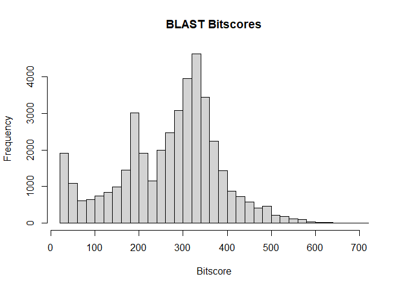
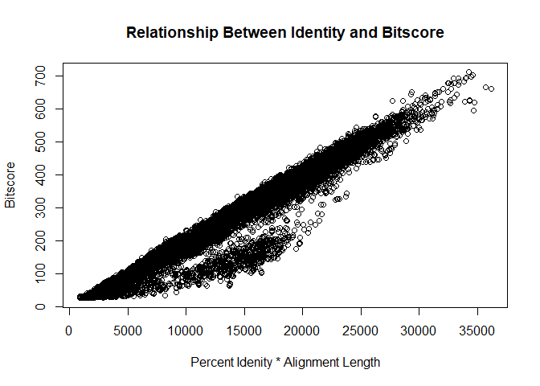

# Class 16: Intro to UNIX
Jolie Adair (PID A17337497)

## Basic Unix

Some important file system commands include: pwd: print working
directory Is: list files and folders od: change directory mk new
directory rm: delete files and directories nano: a very basic text
editor th available less: to view/read text files page by page (page
viewer) My AWS instance: ssh -i “Jas.pem”
ubuntu@ec2-44-251-148-96.us-west-2.compute.amazcom

> Q. What does the star character accomplish here? Ask Barry, or your
> class neighbor, if you are not sure!

The star acts as a wild card.

> Q. How many sequences are in this mouse.1.protein.faa file? Hint: Try
> using grep to figure this out…

there are 55052 sequences

> Q. What happens if you run the above command without the \>
> mm-first.fa part?

It will return the data but not make a file.

> Q. What happens if you were to use two ‘\>’ symbols (i.e. \>\>
> mm-first.fa)?

If you have a file with the name of the data your using the “\>\>” it
will put the head data, if you don’t have a file of that name it will do
nothing.

Zerafish results.

``` r
Zbruh <- read.delim("mm-second.x.zebrafish.tsv", header = FALSE)
colnames(Zbruh) <- c("qseqid", "sseqid", "pident", "length", "mismatch",
                     "gapopen", "qstart", "qend", "sstart", "send", "evalue", 
                     "bitscore")
```

## Making a histogram with R of bitscores

``` r
hist(Zbruh$bitscore,
     breaks=30,
     main = "BLAST Bitscores",
     xlab = "Bitscore")
```



``` r
plot(Zbruh$pident * (Zbruh$qend - Zbruh$qstart), 
     Zbruh$bitscore,
     xlab = "Percent Idenity * Alignment Length",
     ylab = "Bitscore",
     main = "Relationship Between Identity and Bitscore")
```



> Q. Note the addition of the -r option here: What is it purpose? Also
> what about the \*, what is it’s purpose here?

The -r will copy directories instead of individual files. The \* will is
so that every file in the “work” directory is copied.
