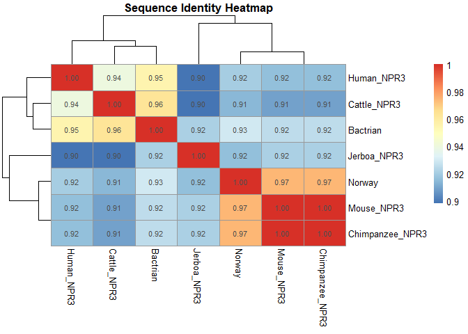

# gene project


``` r
library(bio3d)
library(pheatmap)
algn <- read.fasta("NPR3.aln-fasta")
```

``` r
identity_matrix <- seqidentity(algn$ali)
```

``` r
pheatmap(identity_matrix,
         cluster_rows = TRUE,
         cluster_cols = TRUE,
         display_numbers = TRUE,
         fontsize_number = 8,
         fontsize_row = 10,
         fontsize_col = 10,
         main = "Sequence Identity Heatmap")
```



``` r
identity_matrix
```

                    Jerboa_NPR3 Mouse_NPR3 Chimpanzee_NPR3 Norway Human_NPR3
    Jerboa_NPR3           1.000      0.921           0.921  0.916      0.898
    Mouse_NPR3            0.921      1.000           1.000  0.974      0.916
    Chimpanzee_NPR3       0.921      1.000           1.000  0.974      0.916
    Norway                0.916      0.974           0.974  1.000      0.920
    Human_NPR3            0.898      0.916           0.916  0.920      1.000
    Cattle_NPR3           0.898      0.909           0.909  0.914      0.939
    Bactrian              0.921      0.925           0.925  0.929      0.955
                    Cattle_NPR3 Bactrian
    Jerboa_NPR3           0.898    0.921
    Mouse_NPR3            0.909    0.925
    Chimpanzee_NPR3       0.909    0.925
    Norway                0.914    0.929
    Human_NPR3            0.939    0.955
    Cattle_NPR3           1.000    0.963
    Bactrian              0.963    1.000

``` r
rowMeans(identity_matrix)
```

        Jerboa_NPR3      Mouse_NPR3 Chimpanzee_NPR3          Norway      Human_NPR3 
          0.9250000       0.9492857       0.9492857       0.9467143       0.9348571 
        Cattle_NPR3        Bactrian 
          0.9331429       0.9454286 

``` r
sort(rowMeans(identity_matrix), decreasing = TRUE)
```

         Mouse_NPR3 Chimpanzee_NPR3          Norway        Bactrian      Human_NPR3 
          0.9492857       0.9492857       0.9467143       0.9454286       0.9348571 
        Cattle_NPR3     Jerboa_NPR3 
          0.9331429       0.9250000 

``` r
query.seq <- algn$ali[which(algn$id == "Mouse_NPR3"), ]
```

``` r
query.seq <- paste(query.seq, collapse = "")
query.seq <- gsub("-", "", query.seq)
query.seq
```

    [1] "MRSLLLFTFSACVLLARVLLAGGASSGAGDTRPGSRRRAREALAAQKIEVLVLLPRDDSYLFSLARVRPAIEYALRSVEGNGTGRKLLPPGTRFQVAYEDSDCGNRALFSLVDRVAAARGAKPDLILGPVCEYAAAPVARLASHWDLPMLSAGALAAGFQHKDTEYSHLTRVAPAYAKMGEMMLALFRHHHWSRAALVYSDDKLERNCYFTLEGVHEVFQEEGLHTSAYNFDETKDLDLDDIVRYIQGSERVVIMCASGDTIRRIMLAVHRHGMTSGDYAFFNIELFNSSSYGDGSWRRGDKHDSEAKQAYSSLQTVTLLRTVKPEFEKFSMEVKSSVEKQGLNEEDYVNMFVEGFHDAILLYVLALHEVLRAGYSKKDGGKIIQQTWNRTFEGIAGQVSIDANGDRYGDFSVVAMTDTEAGTQEVIGDYFGKEGRFQMRSNVKYPWGPLKLRLDETRIVEHTNSSPCKSSGGLEESAVTGIVVGALLGAGLLMAFYFFRKKYRITIERRNQQEESNIGKHRELREDSIRSHFSVA"

``` r
pdb.hits <- blast.pdb(query.seq)
```

     Searching ... please wait (updates every 5 seconds) RID = VEW1WCET016 
     ...
     Reporting 8 hits

``` r
head(pdb.hits$hit.tbl)
```

            queryid subjectids identity alignmentlength mismatches gapopens q.start
    1 Query_6251549     1YK0_A   89.792             480         44        1       1
    2 Query_6251549     1YK1_A   89.958             478         43        1       3
    3 Query_6251549     1JDN_A   94.104             441         25        1      40
    4 Query_6251549     1DP4_A   34.532             417        248       11      48
    5 Query_6251549     9DZH_A   33.613             476        288       12      44
    6 Query_6251549     8TG9_A   34.845             419        246       11      47
      q.end s.start s.end   evalue bitscore positives mlog.evalue pdb.id    acc
    1   475       1   480 0.00e+00      881     92.08    709.1962 1YK0_A 1YK0_A
    2   475       2   479 0.00e+00      880     92.26    709.1962 1YK1_A 1YK1_A
    3   480       2   441 0.00e+00      866     96.15    709.1962 1JDN_A 1JDN_A
    4   447       3   411 7.65e-65      219     51.32    147.6333 1DP4_A 1DP4_A
    5   501       1   466 1.79e-63      225     48.32    144.4806 9DZH_A 9DZH_A
    6   447       2   411 8.62e-63      214     49.64    142.9088 8TG9_A 8TG9_A

``` r
hits <- pdb.hits$hit.tbl
unique.hits <- hits[!duplicated(hits$pdb.id), ]
```

``` r
top3 <- unique.hits[1:3, ]
top3
```

            queryid subjectids identity alignmentlength mismatches gapopens q.start
    1 Query_6251549     1YK0_A   89.792             480         44        1       1
    2 Query_6251549     1YK1_A   89.958             478         43        1       3
    3 Query_6251549     1JDN_A   94.104             441         25        1      40
      q.end s.start s.end evalue bitscore positives mlog.evalue pdb.id    acc
    1   475       1   480      0      881     92.08    709.1962 1YK0_A 1YK0_A
    2   475       2   479      0      880     92.26    709.1962 1YK1_A 1YK1_A
    3   480       2   441      0      866     96.15    709.1962 1JDN_A 1JDN_A

``` r
anno <- pdb.annotate(top3$pdb.id)
anno 
```

           structureId chainId macromoleculeType chainLength experimentalTechnique
    1YK0_A        1YK0       A           Protein         480                 X-ray
    1YK1_A        1YK1       A           Protein         479                 X-ray
    1JDN_A        1JDN       A           Protein         441                 X-ray
           resolution
    1YK0_A        2.4
    1YK1_A        2.9
    1JDN_A        2.9
                                                                  scopDomain
    1YK0_A                                                              <NA>
    1YK1_A                                                              <NA>
    1JDN_A Hormone binding domain of the atrial natriuretic peptide receptor
                                                           pfam   ligandId
    1YK0_A Receptor family ligand binding region (ANF_receptor) NAG (2),CL
    1YK1_A Receptor family ligand binding region (ANF_receptor) NAG (2),CL
    1JDN_A Receptor family ligand binding region (ANF_receptor)     CL (2)
                                                          ligandName       source
    1YK0_A 2-acetamido-2-deoxy-beta-D-glucopyranose (2),CHLORIDE ION Homo sapiens
    1YK1_A 2-acetamido-2-deoxy-beta-D-glucopyranose (2),CHLORIDE ION Homo sapiens
    1JDN_A                                          CHLORIDE ION (2) Homo sapiens
                                                                                  structureTitle
    1YK0_A structure of natriuretic peptide receptor-C complexed with atrial natriuretic peptide
    1YK1_A  structure of natriuretic peptide receptor-C complexed with brain natriuretic peptide
    1JDN_A                                                 Crystal Structure of Hormone Receptor
                                        citation rObserved rFree rWork spaceGroup
    1YK0_A He, X.L., et al. J Mol Biology (2006)     0.242 0.284 0.240 P 21 21 21
    1YK1_A He, X.L., et al. J Mol Biology (2006)     0.254 0.289 0.253 P 21 21 21
    1JDN_A       He, X.l., et al. Science (2001)        NA 0.256 0.243   P 61 2 2

``` r
anno_match <- anno[match(top3$pdb.id, anno$structureId), ]

q8_table <- data.frame(
  PDB_ID = top3$pdb.id,
  Evalue = top3$evalue,
  Identity = top3$identity,
  Method = anno_match$experimentalTechnique,
  Resolution = anno_match$resolution,
  Source = anno_match$source
)

q8_table
```

      PDB_ID Evalue Identity Method Resolution Source
    1 1YK0_A      0   89.792   <NA>         NA   <NA>
    2 1YK1_A      0   89.958   <NA>         NA   <NA>
    3 1JDN_A      0   94.104   <NA>         NA   <NA>

``` r
head(pdb.hits$hit.tbl)
```

            queryid subjectids identity alignmentlength mismatches gapopens q.start
    1 Query_6251549     1YK0_A   89.792             480         44        1       1
    2 Query_6251549     1YK1_A   89.958             478         43        1       3
    3 Query_6251549     1JDN_A   94.104             441         25        1      40
    4 Query_6251549     1DP4_A   34.532             417        248       11      48
    5 Query_6251549     9DZH_A   33.613             476        288       12      44
    6 Query_6251549     8TG9_A   34.845             419        246       11      47
      q.end s.start s.end   evalue bitscore positives mlog.evalue pdb.id    acc
    1   475       1   480 0.00e+00      881     92.08    709.1962 1YK0_A 1YK0_A
    2   475       2   479 0.00e+00      880     92.26    709.1962 1YK1_A 1YK1_A
    3   480       2   441 0.00e+00      866     96.15    709.1962 1JDN_A 1JDN_A
    4   447       3   411 7.65e-65      219     51.32    147.6333 1DP4_A 1DP4_A
    5   501       1   466 1.79e-63      225     48.32    144.4806 9DZH_A 9DZH_A
    6   447       2   411 8.62e-63      214     49.64    142.9088 8TG9_A 8TG9_A

``` r
anno
```

           structureId chainId macromoleculeType chainLength experimentalTechnique
    1YK0_A        1YK0       A           Protein         480                 X-ray
    1YK1_A        1YK1       A           Protein         479                 X-ray
    1JDN_A        1JDN       A           Protein         441                 X-ray
           resolution
    1YK0_A        2.4
    1YK1_A        2.9
    1JDN_A        2.9
                                                                  scopDomain
    1YK0_A                                                              <NA>
    1YK1_A                                                              <NA>
    1JDN_A Hormone binding domain of the atrial natriuretic peptide receptor
                                                           pfam   ligandId
    1YK0_A Receptor family ligand binding region (ANF_receptor) NAG (2),CL
    1YK1_A Receptor family ligand binding region (ANF_receptor) NAG (2),CL
    1JDN_A Receptor family ligand binding region (ANF_receptor)     CL (2)
                                                          ligandName       source
    1YK0_A 2-acetamido-2-deoxy-beta-D-glucopyranose (2),CHLORIDE ION Homo sapiens
    1YK1_A 2-acetamido-2-deoxy-beta-D-glucopyranose (2),CHLORIDE ION Homo sapiens
    1JDN_A                                          CHLORIDE ION (2) Homo sapiens
                                                                                  structureTitle
    1YK0_A structure of natriuretic peptide receptor-C complexed with atrial natriuretic peptide
    1YK1_A  structure of natriuretic peptide receptor-C complexed with brain natriuretic peptide
    1JDN_A                                                 Crystal Structure of Hormone Receptor
                                        citation rObserved rFree rWork spaceGroup
    1YK0_A He, X.L., et al. J Mol Biology (2006)     0.242 0.284 0.240 P 21 21 21
    1YK1_A He, X.L., et al. J Mol Biology (2006)     0.254 0.289 0.253 P 21 21 21
    1JDN_A       He, X.l., et al. Science (2001)        NA 0.256 0.243   P 61 2 2
