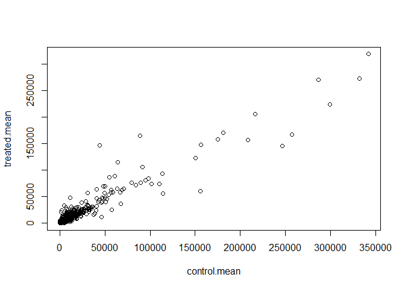
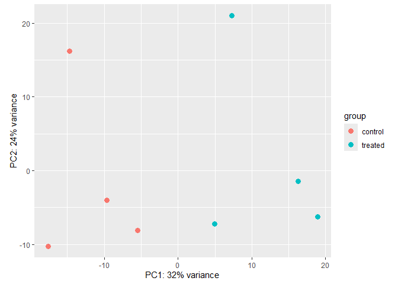
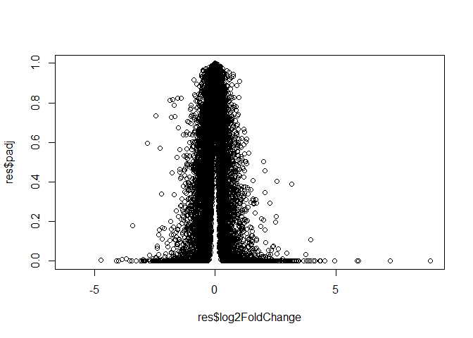
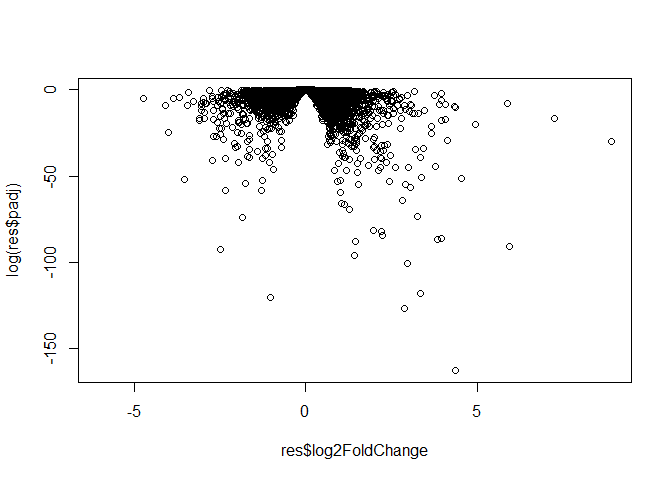
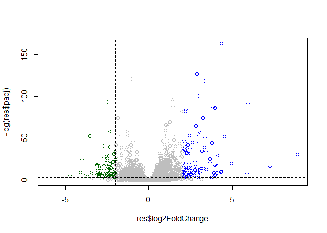
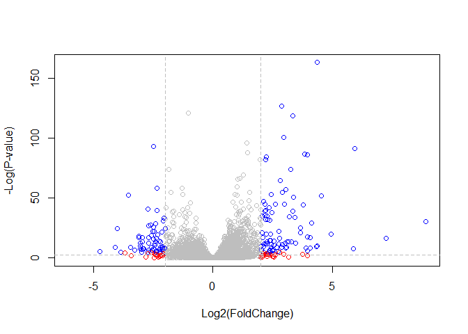
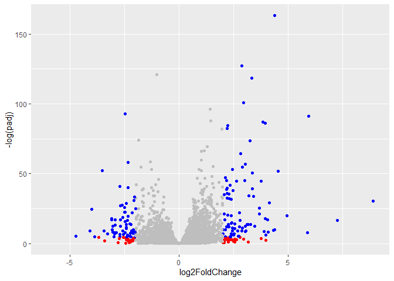

# Class 13 RNASeq with DESeq2
Jolie Adair PID A17337497

## Background

Today we will perform an RNASeq analysis of thge effects ofa ac ommon
stertoid on airway cells.

In particular, dexamethasone (herafter just called “dex”) on different
airways smooth muscle cells lines (ASM cells).

## Data Import

We need two different inputs:

- **countData**: with genes in rowa and experiments in columns
- **colData**: meta data that describes the columns in countData

``` r
counts <- read.csv("airway_scaledcounts.csv", row.names=1)
metadata <- read.csv("airway_metadata.csv")
```

``` r
head(counts)
```

                    SRR1039508 SRR1039509 SRR1039512 SRR1039513 SRR1039516
    ENSG00000000003        723        486        904        445       1170
    ENSG00000000005          0          0          0          0          0
    ENSG00000000419        467        523        616        371        582
    ENSG00000000457        347        258        364        237        318
    ENSG00000000460         96         81         73         66        118
    ENSG00000000938          0          0          1          0          2
                    SRR1039517 SRR1039520 SRR1039521
    ENSG00000000003       1097        806        604
    ENSG00000000005          0          0          0
    ENSG00000000419        781        417        509
    ENSG00000000457        447        330        324
    ENSG00000000460         94        102         74
    ENSG00000000938          0          0          0

``` r
metadata
```

              id     dex celltype     geo_id
    1 SRR1039508 control   N61311 GSM1275862
    2 SRR1039509 treated   N61311 GSM1275863
    3 SRR1039512 control  N052611 GSM1275866
    4 SRR1039513 treated  N052611 GSM1275867
    5 SRR1039516 control  N080611 GSM1275870
    6 SRR1039517 treated  N080611 GSM1275871
    7 SRR1039520 control  N061011 GSM1275874
    8 SRR1039521 treated  N061011 GSM1275875

> Q1. How many genes are in this dataset?

``` r
nrow(counts)
```

    [1] 38694

> Q2. How many ‘control’ cell lines do we have?

``` r
sum (metadata$dex == "control")
```

    [1] 4

``` r
table(metadata$dex)
```


    control treated 
          4       4 

## Differential gene expression

We have 4 replicate drug treated and control (no drug )
columns/experiments in out `counts` objects.

We want one “mean” value for each gene (rows) in “treated” (drug) and
one mean value for each gene in “control” cols.

Step 1 - Find alll “control” columns Step 2 - Extract these columns to a
new objects called `control.counts` Step 3 - Then calculate the mean
value for each gene

step 1

``` r
control.inds <- metadata$dex == "control"
```

Step 2

``` r
control.counts <- counts[ , control.inds]
```

Step 3

``` r
control.mean <- rowMeans(control.counts)
```

> Q3. How would you make the above code in either approach more robust?
> Is there a function that could help here?

We can use the code `rowMeans()` function to make the code more robust.

> Q4. Follow the same procedure for the treated samples (i.e. calculate
> the mean per gene across drug treated samples and assign to a labeled
> vector called treated.mean)

Now we do the same thing for the “treated” columns/experiments

``` r
treated.inds <- metadata$dex == "treated"
```

``` r
treated.counts <- counts[ , treated.inds]
```

``` r
treated.mean <- rowMeans(treated.counts)
```

Put these together for easy book keeping as `meancounts`

``` r
meanscounts <- data.frame(control.mean, treated.mean)
```

A quick plot

``` r
plot(meanscounts)
```



Let’s log transform this count data

``` r
plot(meanscounts, log="xy")
```

    Warning in xy.coords(x, y, xlabel, ylabel, log): 15032 x values <= 0 omitted
    from logarithmic plot

    Warning in xy.coords(x, y, xlabel, ylabel, log): 15281 y values <= 0 omitted
    from logarithmic plot


**N.B.** We most often use log2 for this type of data as it makes the
interpertion musch more strightforward.

Treated/Control is often called “fold-change”

If there was no change we would have a log2- fc of zero

``` r
log2(10/10)
```

    [1] 0

If we had double as much transcript around

``` r
log2(20/10)
```

    [1] 1

If we had half as much transcript around

``` r
log2(5/10)
```

    [1] -1

> Q. calculate a log2 fold change value for all genes and add it as a
> new column to our `meancounts` objects.

``` r
meanscounts$log2f <- log2(meanscounts$treated.mean/meanscounts$control.mean)

head(meanscounts)
```

                    control.mean treated.mean       log2f
    ENSG00000000003       900.75       658.00 -0.45303916
    ENSG00000000005         0.00         0.00         NaN
    ENSG00000000419       520.50       546.00  0.06900279
    ENSG00000000457       339.75       316.50 -0.10226805
    ENSG00000000460        97.25        78.75 -0.30441833
    ENSG00000000938         0.75         0.00        -Inf

``` r
log2(40/10)
```

    [1] 2

There are some “funky” log2dc valuse (NaN and -Inf) here that come about
when ever we have 0 mean count values. Typically we would remove these
genes from further

> Q7. What is the purpose of the arr.ind argument in the which()
> function call above? Why would we then take the first column of the
> output and need to call the unique() function?

``` r
zero.vals <- which(meanscounts[,1:2]==0, arr.ind=TRUE)

to.rm <- unique(zero.vals[,1])
mycounts <- meanscounts[-to.rm,]
head(mycounts)
```

                    control.mean treated.mean       log2f
    ENSG00000000003       900.75       658.00 -0.45303916
    ENSG00000000419       520.50       546.00  0.06900279
    ENSG00000000457       339.75       316.50 -0.10226805
    ENSG00000000460        97.25        78.75 -0.30441833
    ENSG00000000971      5219.00      6687.50  0.35769358
    ENSG00000001036      2327.00      1785.75 -0.38194109

> Q8. Using the up.ind vector above can you determine how many up
> regulated genes we have at the greater than 2 fc level?

250

``` r
up.ind<- mycounts$log2f > 2
sum(up.ind)
```

    [1] 250

> Q9. Using the down.ind vector above can you determine how many down
> regulated genes we have at the greater than 2 fc level?

367

``` r
down.ind <- mycounts$log2fc < (-2)
sum(down.ind)
```

    [1] 0

## DESeq analysis

Let’s do this analysis with an estimate of statistical significance
using the **DESeq2** package.

``` r
library(DESeq2)
```

    Loading required package: S4Vectors

    Loading required package: stats4

    Loading required package: BiocGenerics

    Loading required package: generics


    Attaching package: 'generics'

    The following objects are masked from 'package:base':

        as.difftime, as.factor, as.ordered, intersect, is.element, setdiff,
        setequal, union


    Attaching package: 'BiocGenerics'

    The following objects are masked from 'package:stats':

        IQR, mad, sd, var, xtabs

    The following objects are masked from 'package:base':

        anyDuplicated, aperm, append, as.data.frame, basename, cbind,
        colnames, dirname, do.call, duplicated, eval, evalq, Filter, Find,
        get, grep, grepl, is.unsorted, lapply, Map, mapply, match, mget,
        order, paste, pmax, pmax.int, pmin, pmin.int, Position, rank,
        rbind, Reduce, rownames, sapply, saveRDS, table, tapply, unique,
        unsplit, which.max, which.min


    Attaching package: 'S4Vectors'

    The following object is masked from 'package:utils':

        findMatches

    The following objects are masked from 'package:base':

        expand.grid, I, unname

    Loading required package: IRanges


    Attaching package: 'IRanges'

    The following object is masked from 'package:grDevices':

        windows

    Loading required package: GenomicRanges

    Loading required package: Seqinfo

    Loading required package: SummarizedExperiment

    Loading required package: MatrixGenerics

    Loading required package: matrixStats


    Attaching package: 'MatrixGenerics'

    The following objects are masked from 'package:matrixStats':

        colAlls, colAnyNAs, colAnys, colAvgsPerRowSet, colCollapse,
        colCounts, colCummaxs, colCummins, colCumprods, colCumsums,
        colDiffs, colIQRDiffs, colIQRs, colLogSumExps, colMadDiffs,
        colMads, colMaxs, colMeans2, colMedians, colMins, colOrderStats,
        colProds, colQuantiles, colRanges, colRanks, colSdDiffs, colSds,
        colSums2, colTabulates, colVarDiffs, colVars, colWeightedMads,
        colWeightedMeans, colWeightedMedians, colWeightedSds,
        colWeightedVars, rowAlls, rowAnyNAs, rowAnys, rowAvgsPerColSet,
        rowCollapse, rowCounts, rowCummaxs, rowCummins, rowCumprods,
        rowCumsums, rowDiffs, rowIQRDiffs, rowIQRs, rowLogSumExps,
        rowMadDiffs, rowMads, rowMaxs, rowMeans2, rowMedians, rowMins,
        rowOrderStats, rowProds, rowQuantiles, rowRanges, rowRanks,
        rowSdDiffs, rowSds, rowSums2, rowTabulates, rowVarDiffs, rowVars,
        rowWeightedMads, rowWeightedMeans, rowWeightedMedians,
        rowWeightedSds, rowWeightedVars

    Loading required package: Biobase

    Welcome to Bioconductor

        Vignettes contain introductory material; view with
        'browseVignettes()'. To cite Bioconductor, see
        'citation("Biobase")', and for packages 'citation("pkgname")'.


    Attaching package: 'Biobase'

    The following object is masked from 'package:MatrixGenerics':

        rowMedians

    The following objects are masked from 'package:matrixStats':

        anyMissing, rowMedians

DESeq (like many bioconductor packages) want it’s input data in a very
specific way.

``` r
dds <- DESeqDataSetFromMatrix(countData = counts, 
                       colData = metadata,
                       design = ~dex)
```

    converting counts to integer mode

    Warning in DESeqDataSet(se, design = design, ignoreRank): some variables in
    design formula are characters, converting to factors

## PCA

``` r
vsd <- vst(dds, blind = FALSE)
plotPCA(vsd, intgroup = c("dex"))
```

    using ntop=500 top features by variance



``` r
pcaData <- plotPCA(vsd, intgroup=c("dex"), returnData=TRUE)
```

    using ntop=500 top features by variance

using ntop=500 top features by variance

``` r
head(pcaData)
```

                      PC1        PC2   group       name         id     dex celltype
    SRR1039508 -17.607922 -10.225252 control SRR1039508 SRR1039508 control   N61311
    SRR1039509   4.996738  -7.238117 treated SRR1039509 SRR1039509 treated   N61311
    SRR1039512  -5.474456  -8.113993 control SRR1039512 SRR1039512 control  N052611
    SRR1039513  18.912974  -6.226041 treated SRR1039513 SRR1039513 treated  N052611
    SRR1039516 -14.729173  16.252000 control SRR1039516 SRR1039516 control  N080611
    SRR1039517   7.279863  21.008034 treated SRR1039517 SRR1039517 treated  N080611
                   geo_id sizeFactor
    SRR1039508 GSM1275862  1.0193796
    SRR1039509 GSM1275863  0.9005653
    SRR1039512 GSM1275866  1.1784239
    SRR1039513 GSM1275867  0.6709854
    SRR1039516 GSM1275870  1.1731984
    SRR1039517 GSM1275871  1.3929361

Calculate percent variance per PC for the plot axis labels

``` r
percentVar <- round(100 * attr(pcaData, "percentVar"))
```

## Run the DESeq analysis pipline

The main function `DESeq()`

``` r
dds <- DESeq(dds)
```

    estimating size factors

    estimating dispersions

    gene-wise dispersion estimates

    mean-dispersion relationship

    final dispersion estimates

    fitting model and testing

``` r
res <- results(dds)
head(res)
```

    log2 fold change (MLE): dex treated vs control 
    Wald test p-value: dex treated vs control 
    DataFrame with 6 rows and 6 columns
                      baseMean log2FoldChange     lfcSE      stat    pvalue
                     <numeric>      <numeric> <numeric> <numeric> <numeric>
    ENSG00000000003 747.194195     -0.3507030  0.168246 -2.084470 0.0371175
    ENSG00000000005   0.000000             NA        NA        NA        NA
    ENSG00000000419 520.134160      0.2061078  0.101059  2.039475 0.0414026
    ENSG00000000457 322.664844      0.0245269  0.145145  0.168982 0.8658106
    ENSG00000000460  87.682625     -0.1471420  0.257007 -0.572521 0.5669691
    ENSG00000000938   0.319167     -1.7322890  3.493601 -0.495846 0.6200029
                         padj
                    <numeric>
    ENSG00000000003  0.163035
    ENSG00000000005        NA
    ENSG00000000419  0.176032
    ENSG00000000457  0.961694
    ENSG00000000460  0.815849
    ENSG00000000938        NA

``` r
36000*0.05
```

    [1] 1800

## Volcano plot

This is a main summary results figure from these kinds of studies. It is
a plot of Log2-foldchange vs P-value

``` r
plot(res$log2FoldChange, res$padj)
```



Again this y-axis is highly needs log transforming and we can flip the
y-axis with a minus

``` r
plot(res$log2FoldChange, log(res$padj))
```



``` r
plot(res$log2FoldChange, -log(res$padj))
abline(v=-2, col="red")
abline(v=+2, col="red")
abline(h=-log(0.05), col="red")
```


## Adding some color annotation

Start with a default base color gray

``` r
mycols <-rep("gray", nrow(res))
mycols[res$log2FoldChange > 2] <- "blue"
mycols[res$log2FoldChange < -2] <- "darkgreen"
mycols[res$padj >= 0.05] <- "gray"
          
# volcano plot
plot(res$log2FoldChange, -log(res$padj), col=mycols)

#cut-off dashed lines
abline(v=c(-2,+2), lty=2)
abline(h=-log(0.05), lty=2)
```



## Setup our custom point color vector

Start with default nase color “gray”

``` r
mycols <- rep("gray", nrow(res))
mycols[ abs(res$log2FoldChange) > 2 ]  <- "red"

inds <- (res$padj < 0.01) & (abs(res$log2FoldChange) > 2 )
mycols[ inds ] <- "blue"

# Volcano plot with custom colors
plot( res$log2FoldChange,  -log(res$padj),
 col=mycols, ylab="-Log(P-value)", xlab="Log2(FoldChange)" )

# Cut-off lines
abline(v=c(-2,2), col="gray", lty=2)
abline(h=-log(0.1), col="gray", lty=2)
```



``` r
library(ggplot2)

ggplot(res) +
  aes(log2FoldChange,
      -log(padj)) +
  geom_point(colour = mycols)
```

    Warning: Removed 23549 rows containing missing values or values outside the scale range
    (`geom_point()`).



``` r
labs(x="Log2 Fold-change",
     y="-log Adjusted p-value") +
  geom_vline(xintercept = c(-2,2)) +
  geom_hline(yintercept = -log(0.05)) +
  theme_bw()
```

    NULL

> Q. Make a presentation quaility ggplot version of this plot. Include
> clear axis labels, a clean theme, your custom colors, cut-off lines
> and a plot title.

## Save our Results

Write a CSV file

``` r
write.csv(res, file="results.csv")
```

## Add Annotation

We need to add missing annotation data to our main `res` results object.
This includes the common gene “symbol”

``` r
head(res)
```

    log2 fold change (MLE): dex treated vs control 
    Wald test p-value: dex treated vs control 
    DataFrame with 6 rows and 6 columns
                      baseMean log2FoldChange     lfcSE      stat    pvalue
                     <numeric>      <numeric> <numeric> <numeric> <numeric>
    ENSG00000000003 747.194195     -0.3507030  0.168246 -2.084470 0.0371175
    ENSG00000000005   0.000000             NA        NA        NA        NA
    ENSG00000000419 520.134160      0.2061078  0.101059  2.039475 0.0414026
    ENSG00000000457 322.664844      0.0245269  0.145145  0.168982 0.8658106
    ENSG00000000460  87.682625     -0.1471420  0.257007 -0.572521 0.5669691
    ENSG00000000938   0.319167     -1.7322890  3.493601 -0.495846 0.6200029
                         padj
                    <numeric>
    ENSG00000000003  0.163035
    ENSG00000000005        NA
    ENSG00000000419  0.176032
    ENSG00000000457  0.961694
    ENSG00000000460  0.815849
    ENSG00000000938        NA

We will use R and bioconductor to do this “ID mapping”

``` r
library("AnnotationDbi")
library("org.Hs.eg.db")
```

Let’s see what databases we can use for translation/mapping…

``` r
columns(org.Hs.eg.db)
```

     [1] "ACCNUM"       "ALIAS"        "ENSEMBL"      "ENSEMBLPROT"  "ENSEMBLTRANS"
     [6] "ENTREZID"     "ENZYME"       "EVIDENCE"     "EVIDENCEALL"  "GENENAME"    
    [11] "GENETYPE"     "GO"           "GOALL"        "IPI"          "MAP"         
    [16] "OMIM"         "ONTOLOGY"     "ONTOLOGYALL"  "PATH"         "PFAM"        
    [21] "PMID"         "PROSITE"      "REFSEQ"       "SYMBOL"       "UCSCKG"      
    [26] "UNIPROT"     

We can use the `mapIds()` function now to “translate” between any of
these databases.

``` r
res$symbol<- mapIds(org.Hs.eg.db,
                 keys=row.names(res), # Our genenames
                 keytype="ENSEMBL",    # The format of our genenames
                 column="SYMBOL")      # The new format we want to add
```

    'select()' returned 1:many mapping between keys and columns

``` r
head(res)
```

    log2 fold change (MLE): dex treated vs control 
    Wald test p-value: dex treated vs control 
    DataFrame with 6 rows and 7 columns
                      baseMean log2FoldChange     lfcSE      stat    pvalue
                     <numeric>      <numeric> <numeric> <numeric> <numeric>
    ENSG00000000003 747.194195     -0.3507030  0.168246 -2.084470 0.0371175
    ENSG00000000005   0.000000             NA        NA        NA        NA
    ENSG00000000419 520.134160      0.2061078  0.101059  2.039475 0.0414026
    ENSG00000000457 322.664844      0.0245269  0.145145  0.168982 0.8658106
    ENSG00000000460  87.682625     -0.1471420  0.257007 -0.572521 0.5669691
    ENSG00000000938   0.319167     -1.7322890  3.493601 -0.495846 0.6200029
                         padj      symbol
                    <numeric> <character>
    ENSG00000000003  0.163035      TSPAN6
    ENSG00000000005        NA        TNMD
    ENSG00000000419  0.176032        DPM1
    ENSG00000000457  0.961694       SCYL3
    ENSG00000000460  0.815849       FIRRM
    ENSG00000000938        NA         FGR

Q. Also add “ENTREZID”, “GENENAME”

``` r
res$entrez <- mapIds(org.Hs.eg.db,
                     keys=row.names(res),
                     keytype="ENSEMBL",
                     column="ENTREZID")
```

    'select()' returned 1:many mapping between keys and columns

``` r
res$genename <-   mapIds(org.Hs.eg.db,
                 keys=row.names(res), 
                 keytype="ENSEMBL",    
                 column="GENENAME")
```

    'select()' returned 1:many mapping between keys and columns

``` r
ord <- order( res$padj )
#View(res[ord,])
head(res[ord,])
```

    log2 fold change (MLE): dex treated vs control 
    Wald test p-value: dex treated vs control 
    DataFrame with 6 rows and 9 columns
                     baseMean log2FoldChange     lfcSE      stat      pvalue
                    <numeric>      <numeric> <numeric> <numeric>   <numeric>
    ENSG00000152583   954.771        4.36836 0.2371268   18.4220 8.74490e-76
    ENSG00000179094   743.253        2.86389 0.1755693   16.3120 8.10784e-60
    ENSG00000116584  2277.913       -1.03470 0.0650984  -15.8944 6.92855e-57
    ENSG00000189221  2383.754        3.34154 0.2124058   15.7319 9.14433e-56
    ENSG00000120129  3440.704        2.96521 0.2036951   14.5571 5.26424e-48
    ENSG00000148175 13493.920        1.42717 0.1003890   14.2164 7.25128e-46
                           padj      symbol      entrez               genename
                      <numeric> <character> <character>            <character>
    ENSG00000152583 1.32441e-71     SPARCL1        8404           SPARC like 1
    ENSG00000179094 6.13966e-56        PER1        5187 period circadian reg..
    ENSG00000116584 3.49776e-53     ARHGEF2        9181 Rho/Rac guanine nucl..
    ENSG00000189221 3.46227e-52        MAOA        4128    monoamine oxidase A
    ENSG00000120129 1.59454e-44       DUSP1        1843 dual specificity pho..
    ENSG00000148175 1.83034e-42        STOM        2040               stomatin

## Save annoated results to a CSV file

``` r
write.csv(res, file = "results_annotated.csv")
```

## Pathway Analysis

What known biological pathways do our differentially expressed genes
overlap with (i.e. play a role in) ?

There lots of bioconductor packages to do this type of analysis.

We will use one of the oldest called **gage** along with **pathview** to
render nice pics of the pathways we find.

We can install these with the command:
`BiocManager::install( c("pathview", "gage", "gageData"))`

``` r
library(pathview)
```

    ##############################################################################
    Pathview is an open source software package distributed under GNU General
    Public License version 3 (GPLv3). Details of GPLv3 is available at
    http://www.gnu.org/licenses/gpl-3.0.html. Particullary, users are required to
    formally cite the original Pathview paper (not just mention it) in publications
    or products. For details, do citation("pathview") within R.

    The pathview downloads and uses KEGG data. Non-academic uses may require a KEGG
    license agreement (details at http://www.kegg.jp/kegg/legal.html).
    ##############################################################################

``` r
library(gage)
```

``` r
library(gageData)
```

Have a wee peak what is in `gageData`

``` r
# Examine the first 2 pathways in this kegg set for humans
data(kegg.sets.hs)
head(kegg.sets.hs, 2)
```

    $`hsa00232 Caffeine metabolism`
    [1] "10"   "1544" "1548" "1549" "1553" "7498" "9"   

    $`hsa00983 Drug metabolism - other enzymes`
     [1] "10"     "1066"   "10720"  "10941"  "151531" "1548"   "1549"   "1551"  
     [9] "1553"   "1576"   "1577"   "1806"   "1807"   "1890"   "221223" "2990"  
    [17] "3251"   "3614"   "3615"   "3704"   "51733"  "54490"  "54575"  "54576" 
    [25] "54577"  "54578"  "54579"  "54600"  "54657"  "54658"  "54659"  "54963" 
    [33] "574537" "64816"  "7083"   "7084"   "7172"   "7363"   "7364"   "7365"  
    [41] "7366"   "7367"   "7371"   "7372"   "7378"   "7498"   "79799"  "83549" 
    [49] "8824"   "8833"   "9"      "978"   

The main `gage()` function that does that actual work wants a simple
vector as input.

``` r
foldchanges <- res$log2FoldChange
names(foldchanges) <- res$symbol
head(foldchanges)
```

         TSPAN6        TNMD        DPM1       SCYL3       FIRRM         FGR 
    -0.35070302          NA  0.20610777  0.02452695 -0.14714205 -1.73228897 

The KEGG database use ENTREZ ids so we need to provide these in our
input vector for **gage**

``` r
names(foldchanges) <- res$entrez
```

Now we can run `gage()`

``` r
# Get the results
keggres = gage(foldchanges, gsets=kegg.sets.hs)
```

What is in the output object `keggress`

``` r
attributes(keggres)
```

    $names
    [1] "greater" "less"    "stats"  

``` r
# Look at the first three down (less) pathways
head(keggres$less, 3)
```

                                          p.geomean stat.mean        p.val
    hsa05332 Graft-versus-host disease 0.0004250461 -3.473346 0.0004250461
    hsa04940 Type I diabetes mellitus  0.0017820293 -3.002352 0.0017820293
    hsa05310 Asthma                    0.0020045888 -3.009050 0.0020045888
                                            q.val set.size         exp1
    hsa05332 Graft-versus-host disease 0.09053483       40 0.0004250461
    hsa04940 Type I diabetes mellitus  0.14232581       42 0.0017820293
    hsa05310 Asthma                    0.14232581       29 0.0020045888

We can use the **pathview** functions to render a figure of any of these
pathways along with annotation for our DEGs

Let’s see the hsa05310 Asthma pathway with our DEGs colored up:

``` r
pathview(gene.data=foldchanges, pathway.id="hsa05310")
```

    'select()' returned 1:1 mapping between keys and columns

    Info: Working in directory C:/Users/user/Desktop/bimm143_github/class13

    Info: Writing image file hsa05310.pathview.png


> Q. Can you render and insert here the pathway figure for
> “Graft-versus-host disease” and “Type I diabetes”?

> Q12. Can you do the same procedure as above to plot the pathview
> figures for the top 2 down-reguled pathways?

``` r
# A different PDF based output of the same data
pathview(gene.data=foldchanges, pathway.id="hsa05310", kegg.native=FALSE)
```

    'select()' returned 1:1 mapping between keys and columns

    Info: Working in directory C:/Users/user/Desktop/bimm143_github/class13

    Info: Writing image file hsa05310.pathview.pdf


``` r
pathview(gene.data=foldchanges, pathway.id="hsa04940")
```

    'select()' returned 1:1 mapping between keys and columns

    Info: Working in directory C:/Users/user/Desktop/bimm143_github/class13

    Info: Writing image file hsa04940.pathview.png
